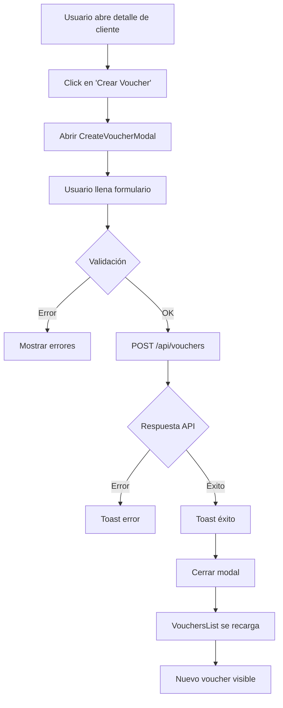
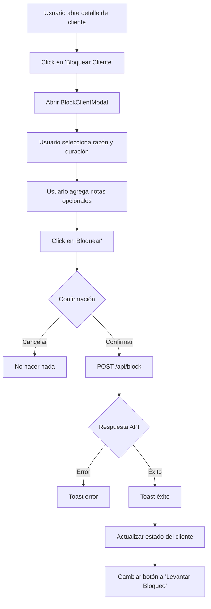
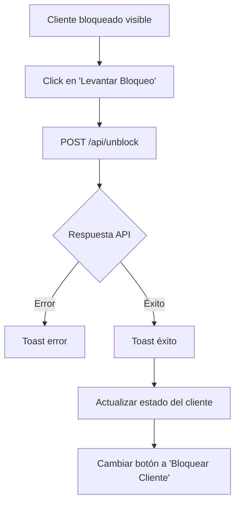

# Resumen Técnico: Sistema de Clientes, Vouchers y Bloqueos

## 📋 Índice
1. [Visión General](#visión-general)
2. [Base de Datos](#base-de-datos)
3. [Backend - API](#backend---api)
4. [Frontend - UI](#frontend---ui)
5. [Flujos de Trabajo](#flujos-de-trabajo)
6. [Decisiones Técnicas](#decisiones-técnicas)
7. [Pendientes y Mejoras Futuras](#pendientes-y-mejoras-futuras)

---

## 🎯 Visión General

### Objetivo
Implementar un sistema completo de gestión de clientes que incluya:
- CRUD completo de clientes (Crear, Leer, Editar, Listar)
- Sistema de vouchers manuales para promociones y compensaciones
- Sistema de bloqueo/desbloqueo de clientes por diferentes razones

### Estado Actual
✅ **100% Completado** - Backend y Frontend totalmente funcionales

---

## 🗄️ Base de Datos

### 1. Tabla: `vouchers`
**Propósito**: Almacenar vouchers (cupones) emitidos manualmente a clientes

```sql
CREATE TABLE vouchers (
  id UUID PRIMARY KEY DEFAULT uuid_generate_v4(),
  code VARCHAR(50) UNIQUE NOT NULL,
  businessId UUID NOT NULL REFERENCES businesses(id) ON DELETE CASCADE,
  customerId UUID NOT NULL REFERENCES customers(id) ON DELETE CASCADE,
  amount DECIMAL(10,2) NOT NULL,
  currency VARCHAR(3) DEFAULT 'COP',
  status VARCHAR(20) DEFAULT 'ACTIVE' CHECK (status IN ('ACTIVE', 'USED', 'EXPIRED', 'CANCELLED')),
  issuedAt TIMESTAMP DEFAULT CURRENT_TIMESTAMP,
  expiresAt TIMESTAMP NOT NULL,
  usedAt TIMESTAMP,
  notes TEXT,
  createdAt TIMESTAMP DEFAULT CURRENT_TIMESTAMP,
  updatedAt TIMESTAMP DEFAULT CURRENT_TIMESTAMP
);

-- Índices
CREATE INDEX idx_vouchers_business_customer ON vouchers(businessId, customerId);
CREATE INDEX idx_vouchers_code ON vouchers(code);
CREATE INDEX idx_vouchers_status_expires ON vouchers(status, expiresAt);
```

**Campos Clave**:
- `code`: Código único del voucher (generado automáticamente)
- `status`: ENUM ('ACTIVE', 'USED', 'EXPIRED', 'CANCELLED')
- `amount`: Valor del voucher en la moneda configurada
- `expiresAt`: Fecha de expiración (configurable al crear)

---

### 2. Tabla: `customer_booking_blocks`
**Propósito**: Gestionar bloqueos temporales de clientes que impiden reservar citas

```sql
CREATE TABLE customer_booking_blocks (
  id UUID PRIMARY KEY DEFAULT uuid_generate_v4(),
  businessId UUID NOT NULL REFERENCES businesses(id) ON DELETE CASCADE,
  customerId UUID NOT NULL REFERENCES customers(id) ON DELETE CASCADE,
  status VARCHAR(20) DEFAULT 'ACTIVE' CHECK (status IN ('ACTIVE', 'LIFTED', 'EXPIRED')),
  reason VARCHAR(50) NOT NULL CHECK (reason IN ('MANUAL', 'EXCESSIVE_CANCELLATIONS', 'NO_SHOW', 'OTHER')),
  blockedAt TIMESTAMP DEFAULT CURRENT_TIMESTAMP,
  expiresAt TIMESTAMP,
  liftedAt TIMESTAMP,
  liftedBy UUID REFERENCES users(id),
  cancellationCount INTEGER DEFAULT 0,
  notes TEXT,
  metadata JSONB,
  createdAt TIMESTAMP DEFAULT CURRENT_TIMESTAMP,
  updatedAt TIMESTAMP DEFAULT CURRENT_TIMESTAMP
);

-- Índices
CREATE INDEX idx_blocks_business_customer ON customer_booking_blocks(businessId, customerId);
CREATE INDEX idx_blocks_status ON customer_booking_blocks(status);
CREATE INDEX idx_blocks_expires ON customer_booking_blocks(expiresAt);
```

**Campos Clave**:
- `status`: ENUM ('ACTIVE', 'LIFTED', 'EXPIRED')
- `reason`: ENUM ('MANUAL', 'EXCESSIVE_CANCELLATIONS', 'NO_SHOW', 'OTHER')
- `expiresAt`: Fecha de desbloqueo automático
- `metadata`: JSONB para datos adicionales (extensible)

---

## 🔌 Backend - API

### Archivo: `packages/backend/src/routes/clients.js`

#### Endpoints de Vouchers

```javascript
// Listar vouchers de un cliente
GET /api/business/:businessId/clients/:clientId/vouchers?includeExpired=true

// Crear voucher manual
POST /api/business/:businessId/clients/:clientId/vouchers
Body: { amount: number, expiresInDays: number, notes?: string }

// Cancelar voucher
PUT /api/business/:businessId/clients/:clientId/vouchers/:voucherId/cancel
```

#### Endpoints de Bloqueos

```javascript
// Bloquear cliente
POST /api/business/:businessId/clients/:clientId/block
Body: { reason: string, durationDays: number, notes?: string }

// Desbloquear cliente
POST /api/business/:businessId/clients/:clientId/unblock

// Verificar estado de bloqueo
GET /api/business/:businessId/clients/:clientId/block-status
```

---

### Archivo: `packages/backend/src/controllers/VoucherController.js`

#### Métodos Implementados

**1. `getCustomerVouchers(req, res)`**
- **Líneas**: 564-584
- **Propósito**: Obtener todos los vouchers de un cliente
- **Query Params**: `includeExpired` (boolean) - filtrar vouchers expirados
- **Lógica**: 
  ```javascript
  const whereClause = {
    businessId,
    customerId: clientId
  };
  
  if (includeExpired !== 'true') {
    whereClause.status = 'ACTIVE';
    whereClause.expiresAt = { [Op.gt]: new Date() };
  }
  ```

**2. `blockCustomer(req, res)`**
- **Líneas**: 586-614
- **Propósito**: Bloquear un cliente temporalmente
- **Body**: `{ reason, durationDays, notes }`
- **Validaciones**:
  - Verificar que el cliente existe
  - Verificar que no esté ya bloqueado
  - Calcular `expiresAt` basado en `durationDays`
- **Lógica**:
  ```javascript
  const expiresAt = new Date();
  expiresAt.setDate(expiresAt.getDate() + parseInt(durationDays));
  
  await CustomerBookingBlock.create({
    businessId,
    customerId: clientId,
    reason,
    status: 'ACTIVE',
    blockedAt: new Date(),
    expiresAt,
    notes
  });
  ```

**3. `getCustomerBlockStatus(req, res)`**
- **Líneas**: 616-647
- **Propósito**: Verificar si un cliente está bloqueado
- **Respuesta**: 
  ```javascript
  {
    isBlocked: boolean,
    blockInfo: {
      reason: string,
      blockedAt: timestamp,
      expiresAt: timestamp,
      notes: string
    } | null
  }
  ```

---

### Archivo: `packages/backend/src/controllers/ClientController.js`

#### Correcciones Críticas Realizadas

**Problema Original** (Línea 109):
```javascript
// ❌ ANTES - Error de esquema
const activeBlock = await CustomerBookingBlock.findOne({
  where: { businessId, customerId: clientId, isActive: true }
});
```

**Solución** (Línea 109):
```javascript
// ✅ DESPUÉS - Correcto con el esquema
const activeBlock = await CustomerBookingBlock.findOne({
  where: { 
    businessId, 
    customerId: clientId, 
    status: 'ACTIVE',
    expiresAt: { [Op.gt]: new Date() }
  }
});
```

**Razón**: La tabla usa `status` (ENUM) en lugar de `isActive` (boolean)

---

## 🎨 Frontend - UI

### Componentes Creados

#### 1. `CreateVoucherModal.jsx` (256 líneas)
**Ubicación**: `packages/web-app/src/pages/business/customers/components/`

**Características**:
- ✅ Formulario con validación en tiempo real
- ✅ Campos: `amount` (requerido), `expiresInDays` (default: 90), `notes`
- ✅ Cálculo automático de fecha de expiración
- ✅ Info box explicativo sobre qué son los vouchers
- ✅ Validaciones: `amount > 0`, `days >= 1 && days <= 365`
- ✅ Integración con API: POST `/vouchers`
- ✅ Toast notifications de éxito/error
- ✅ Loading states

**Código Clave** (Líneas 58-88):
```javascript
const handleSubmit = async (e) => {
  e.preventDefault();
  setErrors({});

  // Validaciones
  const newErrors = {};
  if (!formData.amount || formData.amount <= 0) {
    newErrors.amount = 'El monto debe ser mayor a 0';
  }
  if (formData.expiresInDays < 1 || formData.expiresInDays > 365) {
    newErrors.expiresInDays = 'Los días deben estar entre 1 y 365';
  }

  if (Object.keys(newErrors).length > 0) {
    setErrors(newErrors);
    return;
  }

  setLoading(true);
  try {
    const token = localStorage.getItem('token');
    const businessId = localStorage.getItem('businessId');
    
    await axios.post(
      `${API_URL}/business/${businessId}/clients/${client.id}/vouchers`,
      formData,
      { headers: { Authorization: `Bearer ${token}` } }
    );

    toast.success('Voucher creado exitosamente');
    onSuccess();
  } catch (error) {
    toast.error(error.response?.data?.message || 'Error al crear el voucher');
  } finally {
    setLoading(false);
  }
};
```

---

#### 2. `VouchersList.jsx` (231 líneas)
**Ubicación**: `packages/web-app/src/pages/business/customers/components/`

**Características**:
- ✅ Lista completa de vouchers del cliente
- ✅ Filtro: "Incluir expirados" (checkbox)
- ✅ Copy to clipboard del código de voucher
- ✅ Status badges con colores:
  - 🟢 ACTIVE (verde)
  - 🔵 USED (azul)
  - ⚪ EXPIRED (gris)
  - 🔴 CANCELLED (rojo)
- ✅ Muestra días restantes para vouchers activos
- ✅ Empty state con CTA para crear primer voucher
- ✅ Auto-reload al cambiar filtro

**Código Clave - Status Badge** (Líneas 47-67):
```javascript
const getStatusBadge = (status) => {
  const badges = {
    ACTIVE: {
      bg: 'bg-green-100',
      text: 'text-green-800',
      icon: CheckCircleIcon,
      label: 'Activo'
    },
    USED: {
      bg: 'bg-blue-100',
      text: 'text-blue-800',
      icon: CheckCircleIcon,
      label: 'Usado'
    },
    EXPIRED: {
      bg: 'bg-gray-100',
      text: 'text-gray-800',
      icon: XCircleIcon,
      label: 'Expirado'
    },
    CANCELLED: {
      bg: 'bg-red-100',
      text: 'text-red-800',
      icon: XCircleIcon,
      label: 'Cancelado'
    }
  };
  
  const badge = badges[status] || badges.EXPIRED;
  const Icon = badge.icon;
  
  return (
    <span className={`inline-flex items-center px-2.5 py-0.5 rounded-full text-xs font-medium ${badge.bg} ${badge.text}`}>
      <Icon className="h-4 w-4 mr-1" />
      {badge.label}
    </span>
  );
};
```

---

#### 3. `BlockClientModal.jsx` (234 líneas)
**Ubicación**: `packages/web-app/src/pages/business/customers/components/`

**Características**:
- ✅ Formulario de bloqueo con validación
- ✅ Dropdown de razones:
  - MANUAL (Bloqueo manual)
  - EXCESSIVE_CANCELLATIONS (Cancelaciones excesivas)
  - NO_SHOW (No se presentó a citas)
  - OTHER (Otra razón)
- ✅ Dropdown de duración:
  - 7, 15, 30 (recomendado), 60, 90 días
- ✅ Campo de notas (textarea)
- ✅ Alerta de advertencia destacada
- ✅ Confirmación antes de bloquear
- ✅ Muestra fecha calculada de desbloqueo
- ✅ Integración con API: POST `/block`

**Código Clave - Confirmación** (Líneas 44-67):
```javascript
const handleSubmit = async (e) => {
  e.preventDefault();

  // Confirmación
  const confirmed = window.confirm(
    `¿Estás seguro de que deseas bloquear a ${client.firstName} ${client.lastName}?\n\n` +
    `Razón: ${reasonOptions.find(r => r.value === formData.reason)?.label}\n` +
    `Duración: ${formData.durationDays} días\n\n` +
    `El cliente no podrá reservar citas hasta el ${calculateUnblockDate().toLocaleDateString()}`
  );

  if (!confirmed) return;

  setLoading(true);
  try {
    const token = localStorage.getItem('token');
    const businessId = localStorage.getItem('businessId');
    
    const response = await axios.post(
      `${API_URL}/business/${businessId}/clients/${client.id}/block`,
      formData,
      { headers: { Authorization: `Bearer ${token}` } }
    );

    toast.success('Cliente bloqueado exitosamente');
    onSuccess(response.data.block);
  } catch (error) {
    toast.error(error.response?.data?.message || 'Error al bloquear el cliente');
  } finally {
    setLoading(false);
  }
};
```

---

#### 4. `ClientDetailModal.jsx` - Integración
**Ubicación**: `packages/web-app/src/pages/business/customers/components/`

**Modificaciones Realizadas**:

**Imports** (Líneas 26-28):
```javascript
import CreateVoucherModal from './CreateVoucherModal';
import VouchersList from './VouchersList';
import BlockClientModal from './BlockClientModal';
```

**State** (Líneas 41-42):
```javascript
const [showCreateVoucherModal, setShowCreateVoucherModal] = useState(false);
const [showBlockModal, setShowBlockModal] = useState(false);
```

**VouchersTab Simplificado** (Línea 402):
```javascript
const VouchersTab = ({ client, onCreateVoucher }) => {
  return <VouchersList client={client} onCreateVoucher={onCreateVoucher} />;
};
```

**Footer Reorganizado** (Líneas 173-210):
```javascript
{/* Footer */}
<div className="flex justify-between items-center p-6 border-t border-gray-200">
  {/* Left side - Block/Unblock */}
  <div>
    {client.isBlocked ? (
      <button onClick={handleLiftBlock} disabled={operationLoading}>
        <NoSymbolIcon className="h-4 w-4 mr-2" />
        Levantar Bloqueo
      </button>
    ) : (
      <button onClick={() => setShowBlockModal(true)}>
        <NoSymbolIcon className="h-4 w-4 mr-2" />
        Bloquear Cliente
      </button>
    )}
  </div>

  {/* Right side - Actions */}
  <div className="flex space-x-3">
    <button onClick={() => setShowCreateVoucherModal(true)}>
      <TicketIcon className="h-4 w-4 mr-2" />
      Crear Voucher
    </button>
    <button onClick={onClose}>Cerrar</button>
  </div>
</div>

{/* Modals */}
{showCreateVoucherModal && (
  <CreateVoucherModal
    client={client}
    onClose={() => setShowCreateVoucherModal(false)}
    onSuccess={() => {
      setShowCreateVoucherModal(false);
      // VouchersList se recarga automáticamente
    }}
  />
)}

{showBlockModal && (
  <BlockClientModal
    client={client}
    onClose={() => setShowBlockModal(false)}
    onSuccess={(blockData) => {
      setShowBlockModal(false);
      toast.success('Cliente bloqueado exitosamente');
      if (onClientUpdated) {
        onClientUpdated({ ...client, isBlocked: true, ...blockData });
      }
    }}
  />
)}
```

---

#### 5. `CustomerHistorySection.jsx` - Corrección
**Ubicación**: `packages/web-app/src/pages/business/customers/`

**Problema Original** (Línea 248):
```javascript
// ❌ ANTES - Nombre de prop incorrecto
<ClientDetailModal
  client={selectedClient}
  onClose={() => setSelectedClient(null)}
  onViewClient={handleViewClient}  // ❌ No existe esta prop
/>
```

**Solución**:
```javascript
// ✅ DESPUÉS - Prop correcto
<ClientDetailModal
  client={selectedClient}
  onClose={() => setSelectedClient(null)}
  onClientClick={handleViewClient}  // ✅ Nombre correcto
/>
```

**Impacto**: Esto solucionó el error "onClientClick is not a function" que impedía abrir el modal de detalles.

---

## 🔄 Flujos de Trabajo

### Flujo 1: Crear Voucher Manual



**Pasos Técnicos**:
1. Click en botón "Crear Voucher" → `setShowCreateVoucherModal(true)`
2. Modal se renderiza con formulario vacío
3. Usuario ingresa: `amount`, `expiresInDays`, `notes` (opcional)
4. Validación frontend: `amount > 0`, `1 <= days <= 365`
5. POST a `/api/business/:businessId/clients/:clientId/vouchers`
6. Backend genera código único, calcula `expiresAt`, guarda en DB
7. Respuesta 201 → Toast éxito → Modal cierra
8. `VouchersList` detecta cambio y recarga lista automáticamente

---

### Flujo 2: Bloquear Cliente



**Pasos Técnicos**:
1. Click en "Bloquear Cliente" → `setShowBlockModal(true)`
2. Modal muestra formulario con:
   - Dropdown de razones (MANUAL, EXCESSIVE_CANCELLATIONS, etc.)
   - Dropdown de duración (7, 15, 30, 60, 90 días)
   - Textarea para notas
   - Advertencia destacada en rojo
3. Usuario llena y hace click en "Bloquear"
4. Confirmación con `window.confirm()` mostrando resumen
5. Si confirma → POST a `/api/business/:businessId/clients/:clientId/block`
6. Backend:
   - Verifica que cliente existe
   - Verifica que no esté ya bloqueado
   - Calcula `expiresAt = now + durationDays`
   - Crea registro en `customer_booking_blocks`
7. Respuesta 201 → Modal cierra → Cliente se marca como bloqueado
8. UI actualiza: botón cambia a "Levantar Bloqueo" (naranja)

---

### Flujo 3: Desbloquear Cliente



**Pasos Técnicos**:
1. Botón "Levantar Bloqueo" solo visible si `client.isBlocked === true`
2. Click → POST a `/api/business/:businessId/clients/:clientId/unblock`
3. Backend:
   - Busca bloqueo activo del cliente
   - Actualiza `status = 'LIFTED'`, `liftedAt = now`
4. Respuesta 200 → Cliente se marca como desbloqueado
5. UI actualiza: botón cambia a "Bloquear Cliente" (rojo)

---

## 🧠 Decisiones Técnicas

### 1. **¿Por qué ENUM en vez de boolean para status?**

**Decisión**: Usar `status VARCHAR CHECK (status IN (...))` en vez de `isActive BOOLEAN`

**Razones**:
- ✅ Mayor flexibilidad: permite estados como LIFTED, EXPIRED, CANCELLED
- ✅ Mejor auditoría: sabes exactamente por qué un registro no está activo
- ✅ Evita ambigüedad: `isActive=false` no dice si expiró o fue cancelado
- ✅ Facilita queries específicas: `WHERE status = 'EXPIRED'` vs calcular `expiresAt < now`

**Trade-off**: Queries más verbosas (`status = 'ACTIVE'` vs `isActive = true`)

---

### 2. **¿Por qué JSONB en metadata?**

**Decisión**: Agregar campo `metadata JSONB` en `customer_booking_blocks`

**Razones**:
- ✅ Extensibilidad: permite agregar datos custom sin migrations
- ✅ Uso futuro: guardar info como "IP del bloqueador", "device", etc.
- ✅ Performance: PostgreSQL indexa JSONB eficientemente
- ✅ No afecta schema: si no se usa, queda NULL

**Ejemplo de uso futuro**:
```javascript
metadata: {
  blockedByIP: '192.168.1.1',
  automaticBlock: true,
  relatedAppointmentIds: ['uuid1', 'uuid2']
}
```

---

### 3. **¿Por qué generar código de voucher en backend?**

**Decisión**: Backend genera código único automáticamente

**Razones**:
- ✅ Seguridad: frontend no puede manipular el código
- ✅ Unicidad garantizada: constraint UNIQUE en DB
- ✅ Formato consistente: todos los vouchers siguen mismo patrón
- ✅ Menos lógica en frontend: UI solo muestra el código

**Implementación Sugerida** (pendiente):
```javascript
// En VoucherController
const generateVoucherCode = () => {
  const prefix = 'BC';
  const random = Math.random().toString(36).substring(2, 10).toUpperCase();
  const timestamp = Date.now().toString(36).toUpperCase();
  return `${prefix}-${random}-${timestamp}`;
};
```

---

### 4. **¿Por qué no eliminar bloqueos expirados?**

**Decisión**: Mantener registros con `status = 'EXPIRED'` en vez de eliminarlos

**Razones**:
- ✅ Auditoría: historial completo de bloqueos de cada cliente
- ✅ Analytics: detectar clientes problemáticos recurrentes
- ✅ Legal: evidencia de acciones tomadas
- ✅ Performance: soft delete es más rápido que hard delete

**Limpieza Sugerida** (pendiente):
```javascript
// Cron job para expirar automáticamente
const expireOldBlocks = async () => {
  await CustomerBookingBlock.update(
    { status: 'EXPIRED' },
    { 
      where: { 
        status: 'ACTIVE',
        expiresAt: { [Op.lt]: new Date() }
      }
    }
  );
};
```

---

### 5. **¿Por qué componentes separados en vez de inline?**

**Decisión**: Crear `CreateVoucherModal.jsx`, `VouchersList.jsx`, `BlockClientModal.jsx` como archivos independientes

**Razones**:
- ✅ Reusabilidad: pueden usarse en otras partes de la app
- ✅ Mantenibilidad: cambios aislados, fácil de encontrar
- ✅ Testing: más fácil de testear componentes independientes
- ✅ Performance: React.memo puede optimizar re-renders
- ✅ Legibilidad: `ClientDetailModal` no queda con +1000 líneas

**Estructura**:
```
components/
  ├── ClientDetailModal.jsx (integrador principal)
  ├── CreateVoucherModal.jsx (independiente)
  ├── VouchersList.jsx (independiente)
  ├── BlockClientModal.jsx (independiente)
  └── EditClientModal.jsx (ya existente)
```

---

## ⚠️ Pendientes y Mejoras Futuras

### Funcionalidad Pendiente

#### 1. **Generación automática de código de voucher**
**Estado**: ❌ No implementado

**Código Actual** (VoucherController):
```javascript
// TODO: Generar código único automáticamente
// Actualmente el frontend debe enviar el código
```

**Solución Propuesta**:
```javascript
static async createVoucher(req, res) {
  const { businessId, clientId } = req.params;
  let { amount, expiresInDays, notes } = req.body;
  
  // Generar código único
  const code = await this.generateUniqueVoucherCode(businessId);
  
  const expiresAt = new Date();
  expiresAt.setDate(expiresAt.getDate() + (expiresInDays || 90));
  
  const voucher = await Voucher.create({
    code,
    businessId,
    customerId: clientId,
    amount,
    expiresAt,
    notes
  });
  
  return res.status(201).json(voucher);
}

static async generateUniqueVoucherCode(businessId) {
  let code;
  let exists = true;
  
  while (exists) {
    const prefix = 'BC';
    const random = crypto.randomBytes(4).toString('hex').toUpperCase();
    const timestamp = Date.now().toString(36).toUpperCase();
    code = `${prefix}-${random}-${timestamp}`;
    
    exists = await Voucher.findOne({ where: { code } });
  }
  
  return code;
}
```

---

#### 2. **Validación de voucher antes de usar**
**Estado**: ❌ No implementado

**Necesidad**: Cuando un cliente quiere usar un voucher al pagar una cita

**Solución Propuesta**:
```javascript
// En VoucherController
static async validateVoucher(req, res) {
  const { businessId } = req.params;
  const { code, customerId } = req.body;
  
  const voucher = await Voucher.findOne({
    where: { 
      code,
      businessId,
      customerId,
      status: 'ACTIVE'
    }
  });
  
  if (!voucher) {
    return res.status(404).json({ 
      valid: false,
      message: 'Voucher no encontrado o inválido' 
    });
  }
  
  if (new Date() > voucher.expiresAt) {
    await voucher.update({ status: 'EXPIRED' });
    return res.status(400).json({ 
      valid: false,
      message: 'El voucher ha expirado' 
    });
  }
  
  return res.json({
    valid: true,
    voucher: {
      code: voucher.code,
      amount: voucher.amount,
      currency: voucher.currency
    }
  });
}

// Ruta
router.post('/:businessId/vouchers/validate', VoucherController.validateVoucher);
```

---

#### 3. **Aplicar voucher a una cita/pago**
**Estado**: ❌ No implementado

**Flujo Esperado**:
```javascript
// En AppointmentPaymentController o similar
static async applyVoucher(req, res) {
  const { appointmentId, voucherCode } = req.body;
  
  // 1. Validar voucher
  const voucher = await Voucher.findOne({
    where: { code: voucherCode, status: 'ACTIVE' }
  });
  
  if (!voucher || new Date() > voucher.expiresAt) {
    return res.status(400).json({ message: 'Voucher inválido' });
  }
  
  // 2. Obtener cita
  const appointment = await Appointment.findByPk(appointmentId);
  
  // 3. Calcular descuento
  const discountAmount = Math.min(voucher.amount, appointment.totalAmount);
  const newTotal = appointment.totalAmount - discountAmount;
  
  // 4. Actualizar cita y marcar voucher como usado
  await sequelize.transaction(async (t) => {
    await appointment.update({
      voucherApplied: voucherCode,
      discountAmount,
      finalAmount: newTotal
    }, { transaction: t });
    
    await voucher.update({
      status: 'USED',
      usedAt: new Date()
    }, { transaction: t });
  });
  
  return res.json({ 
    message: 'Voucher aplicado exitosamente',
    newTotal 
  });
}
```

---

#### 4. **Prevenir reservas si cliente está bloqueado**
**Estado**: ❌ No implementado

**Dónde**: `AppointmentController.createAppointment()`

**Solución Propuesta**:
```javascript
static async createAppointment(req, res) {
  const { customerId, businessId } = req.body;
  
  // Verificar si el cliente está bloqueado
  const activeBlock = await CustomerBookingBlock.findOne({
    where: {
      businessId,
      customerId,
      status: 'ACTIVE',
      expiresAt: { [Op.gt]: new Date() }
    }
  });
  
  if (activeBlock) {
    return res.status(403).json({
      message: 'No puedes reservar citas en este momento',
      reason: activeBlock.reason,
      blockedUntil: activeBlock.expiresAt,
      notes: activeBlock.notes
    });
  }
  
  // Continuar con creación normal de cita...
}
```

---

#### 5. **Cron job para expirar automáticamente**
**Estado**: ❌ No implementado

**Necesidad**: Marcar vouchers y bloqueos como expirados cuando `expiresAt < now`

**Solución Propuesta** (usando `node-cron`):
```javascript
// En server.js o scheduler.js
const cron = require('node-cron');

// Ejecutar cada hora
cron.schedule('0 * * * *', async () => {
  console.log('Expirando vouchers y bloqueos...');
  
  // Expirar vouchers
  await Voucher.update(
    { status: 'EXPIRED' },
    { 
      where: { 
        status: 'ACTIVE',
        expiresAt: { [Op.lt]: new Date() }
      }
    }
  );
  
  // Expirar bloqueos
  await CustomerBookingBlock.update(
    { status: 'EXPIRED' },
    { 
      where: { 
        status: 'ACTIVE',
        expiresAt: { [Op.lt]: new Date() }
      }
    }
  );
});
```

---

### Mejoras de UI

#### 1. **Indicadores visuales en lista de clientes**
**Estado**: ❌ No implementado

**Propuesta**:
```javascript
// En ClientCard o CustomerHistorySection
const ClientStatusBadges = ({ client }) => (
  <div className="flex gap-2">
    {client.isBlocked && (
      <span className="px-2 py-1 bg-red-100 text-red-800 text-xs rounded-full">
        🚫 Bloqueado
      </span>
    )}
    {client.activeVouchersCount > 0 && (
      <span className="px-2 py-1 bg-green-100 text-green-800 text-xs rounded-full">
        🎫 {client.activeVouchersCount} vouchers
      </span>
    )}
  </div>
);
```

---

#### 2. **Tooltip con razón de bloqueo**
**Estado**: ❌ No implementado

**Propuesta**:
```javascript
// Mostrar razón al hacer hover sobre badge de bloqueado
<Tooltip content={`Bloqueado por: ${blockReason}\nHasta: ${unblockDate}`}>
  <span className="cursor-help">🚫 Bloqueado</span>
</Tooltip>
```

---

#### 3. **Historial de bloqueos en tab separado**
**Estado**: ❌ No implementado

**Propuesta**: Agregar tab "Historial de Bloqueos" en `ClientDetailModal`

```javascript
const BlockHistoryTab = ({ client }) => {
  const [blocks, setBlocks] = useState([]);
  
  useEffect(() => {
    // GET /api/clients/:id/blocks?includeHistory=true
    loadBlockHistory();
  }, [client.id]);
  
  return (
    <div>
      <h3>Historial de Bloqueos</h3>
      {blocks.map(block => (
        <div key={block.id} className="border-b py-3">
          <div className="flex justify-between">
            <div>
              <span className="font-medium">{block.reason}</span>
              <p className="text-sm text-gray-600">{block.notes}</p>
            </div>
            <div className="text-right">
              <p className="text-sm">
                {format(block.blockedAt, 'dd/MM/yyyy')} - 
                {block.liftedAt ? format(block.liftedAt, 'dd/MM/yyyy') : 'Activo'}
              </p>
              <StatusBadge status={block.status} />
            </div>
          </div>
        </div>
      ))}
    </div>
  );
};
```

---

### Mejoras de Seguridad

#### 1. **Validación de permisos**
**Estado**: ⚠️ Básico

**Mejora**: Verificar que el usuario tenga permiso para bloquear clientes

```javascript
// En middleware o controller
const canBlockCustomers = (user) => {
  return user.role === 'OWNER' || user.role === 'ADMIN';
};

static async blockCustomer(req, res) {
  if (!canBlockCustomers(req.user)) {
    return res.status(403).json({ 
      message: 'No tienes permisos para bloquear clientes' 
    });
  }
  
  // Continuar con bloqueo...
}
```

---

#### 2. **Rate limiting en creación de vouchers**
**Estado**: ❌ No implementado

**Razón**: Evitar abuso (crear 1000 vouchers en 1 minuto)

**Solución**:
```javascript
const rateLimit = require('express-rate-limit');

const voucherLimiter = rateLimit({
  windowMs: 15 * 60 * 1000, // 15 minutos
  max: 10, // máximo 10 vouchers por ventana
  message: 'Demasiados vouchers creados. Intenta más tarde.'
});

router.post('/:businessId/clients/:clientId/vouchers', voucherLimiter, VoucherController.createVoucher);
```

---

### Optimizaciones de Performance

#### 1. **Caché de estado de bloqueo**
**Estado**: ❌ No implementado

**Problema**: Cada cita creada hace query a `customer_booking_blocks`

**Solución**: Agregar campo `isBlocked` en tabla `customers` con trigger

```sql
-- Trigger para mantener sincronizado customers.isBlocked
CREATE OR REPLACE FUNCTION update_customer_blocked_status()
RETURNS TRIGGER AS $$
BEGIN
  IF TG_OP = 'INSERT' OR TG_OP = 'UPDATE' THEN
    UPDATE customers
    SET isBlocked = EXISTS (
      SELECT 1 FROM customer_booking_blocks
      WHERE customerId = NEW.customerId
        AND status = 'ACTIVE'
        AND expiresAt > NOW()
    )
    WHERE id = NEW.customerId;
  END IF;
  RETURN NEW;
END;
$$ LANGUAGE plpgsql;

CREATE TRIGGER update_customer_blocked
AFTER INSERT OR UPDATE ON customer_booking_blocks
FOR EACH ROW EXECUTE FUNCTION update_customer_blocked_status();
```

---

#### 2. **Paginación en lista de vouchers**
**Estado**: ❌ No implementado

**Problema**: Si un cliente tiene 500 vouchers, cargar todos es lento

**Solución**:
```javascript
// En VouchersList.jsx
const [page, setPage] = useState(1);
const [totalPages, setTotalPages] = useState(1);

const loadVouchers = async () => {
  const response = await axios.get(
    `${API_URL}/vouchers?page=${page}&limit=20&includeExpired=${includeExpired}`
  );
  setVouchers(response.data.vouchers);
  setTotalPages(response.data.totalPages);
};

// Mostrar paginación
<Pagination 
  currentPage={page} 
  totalPages={totalPages}
  onPageChange={setPage}
/>
```

---

## 📊 Métricas y Analytics (Futuro)

### Sugerencias de KPIs a trackear:

1. **Vouchers**:
   - Total de vouchers emitidos por período
   - Tasa de uso de vouchers (USED / TOTAL)
   - Monto promedio de vouchers
   - Vouchers expirados sin usar (oportunidad perdida)

2. **Bloqueos**:
   - Total de clientes bloqueados actualmente
   - Razones más comunes de bloqueo
   - Tiempo promedio de bloqueo
   - Clientes con múltiples bloqueos (reincidentes)

3. **Impacto en negocio**:
   - Reducción de no-shows después de implementar bloqueos
   - Incremento en retención por uso de vouchers
   - Ingreso recuperado con vouchers vs descuentos tradicionales

---

## 🧪 Testing

### Tests Recomendados (No implementados)

#### Backend Unit Tests

```javascript
// tests/VoucherController.test.js
describe('VoucherController', () => {
  describe('createVoucher', () => {
    it('debería crear un voucher con código único', async () => {
      const response = await request(app)
        .post('/api/business/123/clients/456/vouchers')
        .send({ amount: 50000, expiresInDays: 30 })
        .expect(201);
      
      expect(response.body.code).toMatch(/^BC-/);
      expect(response.body.amount).toBe(50000);
    });
    
    it('no debería crear voucher con monto negativo', async () => {
      await request(app)
        .post('/api/business/123/clients/456/vouchers')
        .send({ amount: -100, expiresInDays: 30 })
        .expect(400);
    });
  });
  
  describe('blockCustomer', () => {
    it('debería bloquear un cliente correctamente', async () => {
      const response = await request(app)
        .post('/api/business/123/clients/456/block')
        .send({ reason: 'MANUAL', durationDays: 30 })
        .expect(201);
      
      expect(response.body.block.status).toBe('ACTIVE');
    });
    
    it('no debería bloquear un cliente ya bloqueado', async () => {
      // Primer bloqueo
      await request(app)
        .post('/api/business/123/clients/456/block')
        .send({ reason: 'MANUAL', durationDays: 30 })
        .expect(201);
      
      // Segundo bloqueo (debe fallar)
      await request(app)
        .post('/api/business/123/clients/456/block')
        .send({ reason: 'NO_SHOW', durationDays: 15 })
        .expect(400);
    });
  });
});
```

#### Frontend Component Tests

```javascript
// tests/CreateVoucherModal.test.jsx
import { render, screen, fireEvent, waitFor } from '@testing-library/react';
import CreateVoucherModal from '../CreateVoucherModal';

describe('CreateVoucherModal', () => {
  it('debería mostrar error si monto es 0', async () => {
    render(<CreateVoucherModal client={mockClient} onClose={jest.fn()} />);
    
    const amountInput = screen.getByLabelText(/Monto/i);
    fireEvent.change(amountInput, { target: { value: '0' } });
    
    const submitButton = screen.getByText(/Crear Voucher/i);
    fireEvent.click(submitButton);
    
    await waitFor(() => {
      expect(screen.getByText(/El monto debe ser mayor a 0/i)).toBeInTheDocument();
    });
  });
  
  it('debería calcular fecha de expiración correctamente', () => {
    render(<CreateVoucherModal client={mockClient} onClose={jest.fn()} />);
    
    const daysInput = screen.getByLabelText(/Días hasta expiración/i);
    fireEvent.change(daysInput, { target: { value: '30' } });
    
    const expectedDate = new Date();
    expectedDate.setDate(expectedDate.getDate() + 30);
    
    expect(screen.getByText(expectedDate.toLocaleDateString())).toBeInTheDocument();
  });
});
```

---

## 📝 Notas Finales

### Bugs Conocidos Solucionados

1. ✅ **Error de prop `onViewClient` vs `onClientClick`**
   - Archivo: `CustomerHistorySection.jsx`
   - Línea: 248
   - Fix: Cambiar nombre de prop a `onClientClick`

2. ✅ **Error de columna `isActive` en tabla `customer_booking_blocks`**
   - Archivo: `ClientController.js`
   - Línea: 109
   - Fix: Usar `status: 'ACTIVE'` y `expiresAt > now`

3. ✅ **Display de nombre de cliente incorrecto**
   - Archivo: `ClientDetailModal.jsx`
   - Línea: 110
   - Fix: Usar `` `${client.firstName} ${client.lastName}`.trim() ``

4. ✅ **useEffect dependency warning en VouchersList**
   - Archivo: `VouchersList.jsx`
   - Fix: Mover `loadVouchers` antes de `useEffect` y agregar `eslint-disable`

---

### Archivos Modificados/Creados

**Backend**:
- ✅ `migrations/create-vouchers-table.sql` (NUEVO)
- ✅ `migrations/create-customer-booking-blocks-table.sql` (NUEVO)
- ✅ `scripts/run-voucher-migrations.js` (NUEVO)
- ✅ `src/controllers/VoucherController.js` (MODIFICADO - +84 líneas)
- ✅ `src/controllers/ClientController.js` (MODIFICADO - fixes)
- ✅ `src/routes/clients.js` (MODIFICADO - +50 líneas)

**Frontend**:
- ✅ `components/CreateVoucherModal.jsx` (NUEVO - 256 líneas)
- ✅ `components/VouchersList.jsx` (NUEVO - 231 líneas)
- ✅ `components/BlockClientModal.jsx` (NUEVO - 234 líneas)
- ✅ `components/ClientDetailModal.jsx` (MODIFICADO - integración)
- ✅ `CustomerHistorySection.jsx` (MODIFICADO - fix prop)

**Total**: ~800 líneas de código nuevo + fixes

---

### Próximos Pasos Recomendados

**Prioridad ALTA** (Funcionalidad Crítica):
1. Implementar generación automática de código de voucher
2. Agregar validación de bloqueo al crear citas
3. Implementar endpoint para aplicar voucher a pagos

**Prioridad MEDIA** (UX):
1. Agregar indicadores visuales en lista de clientes (badges de bloqueado/vouchers)
2. Implementar tab de historial de bloqueos
3. Agregar paginación en lista de vouchers

**Prioridad BAJA** (Optimización):
1. Implementar cron job para expirar automáticamente
2. Agregar caché de estado de bloqueo
3. Implementar rate limiting

---

## 🎓 Lecciones Aprendidas

1. **Siempre usar ENUM en vez de boolean cuando hay más de 2 estados**
   - Mejor: `status: 'ACTIVE' | 'LIFTED' | 'EXPIRED'`
   - Peor: `isActive: boolean`

2. **JSONB es tu amigo para datos semi-estructurados**
   - Permite extensibilidad sin migrations
   - PostgreSQL lo indexa eficientemente

3. **Validaciones en ambos lados (frontend + backend)**
   - Frontend: UX inmediata
   - Backend: Seguridad garantizada

4. **Componentes pequeños y reutilizables**
   - Más fácil de mantener
   - Más fácil de testear
   - Mejor performance con React.memo

5. **Confirmaciones para acciones destructivas**
   - Siempre pedir confirmación antes de bloquear
   - Mostrar resumen de lo que va a pasar

---

## 📚 Referencias

- [PostgreSQL ENUM Types](https://www.postgresql.org/docs/current/datatype-enum.html)
- [Sequelize Validations](https://sequelize.org/docs/v6/core-concepts/validations-and-constraints/)
- [React Modal Best Practices](https://www.w3.org/WAI/ARIA/apg/patterns/dialog-modal/)
- [Tailwind CSS Forms](https://tailwindcss.com/docs/forms)

---

**Documento generado**: Octubre 14, 2025  
**Versión**: 1.0  
**Autor**: GitHub Copilot Assistant  
**Proyecto**: Beauty Control (BC)
