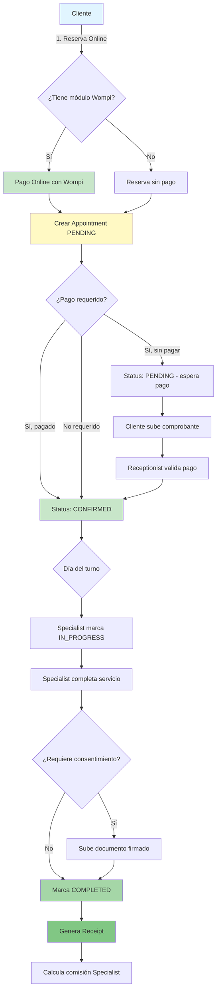
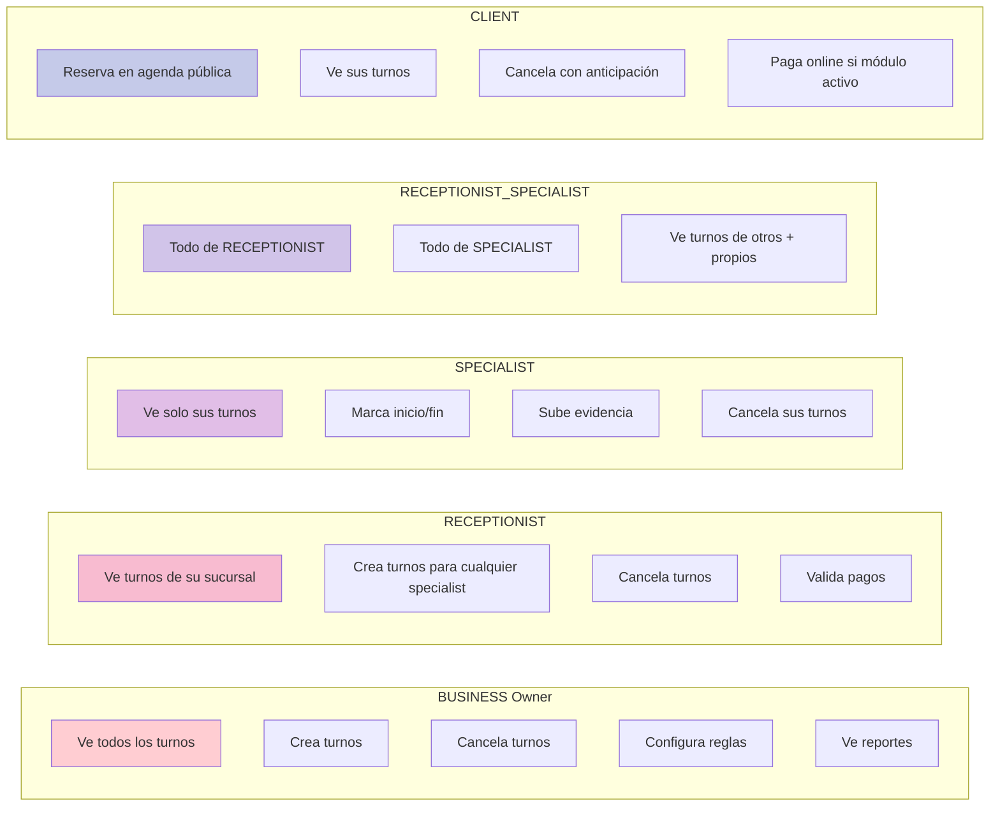

# Análisis del Sistema de Turnos/Appointments - Backend

## 📊 RESUMEN EJECUTIVO

### ✅ Lo que YA ESTÁ funcionando:

1. **Rol RECEPTIONIST_SPECIALIST**: ✅ **SÍ EXISTE** en el modelo User
   - Definido en `User.js` línea 47: `'RECEPTIONIST_SPECIALIST'`
   - Es parte del ENUM de roles válidos

2. **Modelo Appointment**: ✅ **EXISTE** y está bien estructurado
   - Ubicación: `packages/backend/src/models/Appointment.js`
   - Incluye campos para: businessId, branchId, clientId, specialistId, serviceId
   - Estados: PENDING, CONFIRMED, IN_PROGRESS, COMPLETED, CANCELED, NO_SHOW, RESCHEDULED
   - Pagos: paymentStatus (PENDING, PARTIAL, PAID, REFUNDED)
   - Campos de evidencia y consentimiento

3. **Asociaciones existentes**: ✅ **COMPLETAS**
   - Appointment → Business
   - Appointment → Branch
   - Appointment → Client
   - Appointment → User (specialist)
   - Appointment → Service
   - Appointment → User (canceledBy)

---

## ⚠️ PROBLEMAS IDENTIFICADOS

### 1. ❌ **Falta Controller para crear RECEPTIONIST_SPECIALIST**

**Problema**: En `BusinessController.js` línea 564, solo se validan roles:
```javascript
if (!['SPECIALIST', 'RECEPTIONIST'].includes(employeeRole)) {
  return res.status(400).json({
    success: false,
    error: 'Rol de empleado inválido'
  });
}
```

**Solución requerida**: Agregar 'RECEPTIONIST_SPECIALIST' a la validación.

---

### 2. ❌ **NO EXISTE relación Specialist-Service con precios personalizados**

**Problema crítico**: 
- El modelo `Service` tiene un precio global para el negocio
- NO existe tabla intermedia `SpecialistService` para que cada especialista ponga su propio precio
- Solo existe `SpecialistCommission` que es para comisiones, no para precios de servicio

**Situación actual**:
- ✅ Tabla `services`: precio único por servicio a nivel de negocio
- ✅ Tabla `specialist_commissions`: comisión del especialista por servicio
- ❌ **NO hay tabla** para precios personalizados por especialista

**Impacto**: 
- Un especialista senior NO puede cobrar más que un junior por el mismo servicio
- No se puede tener "Corte de cabello by Juan: $50" y "Corte de cabello by María: $35"

---

### 3. ⚠️ **BusinessConfigService.createSpecialist NO está implementado**

**Problema**: 
- El controller llama a `BusinessConfigService.createSpecialist()` (línea 124)
- Pero el servicio está marcado como "TEMPORARILY SIMPLIFIED - under refactoring"
- La función `createSpecialist` NO existe en el archivo

**Ubicación del problema**: `packages/backend/src/services/BusinessConfigService.js`

---

### 4. ⚠️ **Faltan endpoints REST para Appointments**

Necesitas crear:
- `POST /api/public/bookings/:businessId/branches/:branchId` - Reserva pública
- `POST /api/appointments` - Crear turno (interno)
- `PUT /api/appointments/:id/cancel` - Cancelar con motivo
- `PUT /api/appointments/:id/confirm` - Confirmar turno
- `PUT /api/appointments/:id/complete` - Cerrar turno
- `POST /api/appointments/:id/evidence` - Subir comprobante/evidencia
- `GET /api/appointments` - Listar turnos (con filtros por rol)

---

## 🛠️ SOLUCIONES NECESARIAS

### Solución 1: Crear tabla SpecialistService para precios personalizados

```javascript
// packages/backend/src/models/SpecialistService.js
const { DataTypes } = require('sequelize');
const { sequelize } = require('../config/database');

const SpecialistService = sequelize.define('SpecialistService', {
  id: {
    type: DataTypes.UUID,
    defaultValue: DataTypes.UUIDV4,
    primaryKey: true
  },
  specialistId: {
    type: DataTypes.UUID,
    allowNull: false,
    references: {
      model: 'users',
      key: 'id'
    }
  },
  serviceId: {
    type: DataTypes.UUID,
    allowNull: false,
    references: {
      model: 'services',
      key: 'id'
    }
  },
  customPrice: {
    type: DataTypes.DECIMAL(10, 2),
    allowNull: true,
    comment: 'Precio personalizado del especialista. Si es null, usa el precio base del servicio'
  },
  customDuration: {
    type: DataTypes.INTEGER,
    allowNull: true,
    comment: 'Duración personalizada en minutos. Si es null, usa la duración base'
  },
  isActive: {
    type: DataTypes.BOOLEAN,
    allowNull: false,
    defaultValue: true,
    comment: 'Si el especialista ofrece este servicio actualmente'
  },
  displayOrder: {
    type: DataTypes.INTEGER,
    allowNull: false,
    defaultValue: 0,
    comment: 'Orden de visualización en el perfil del especialista'
  },
  specialNotes: {
    type: DataTypes.TEXT,
    allowNull: true,
    comment: 'Notas especiales sobre cómo este especialista realiza este servicio'
  }
}, {
  tableName: 'specialist_services',
  timestamps: true,
  indexes: [
    {
      unique: true,
      fields: ['specialistId', 'serviceId'],
      name: 'unique_specialist_service'
    },
    {
      fields: ['isActive']
    }
  ]
});

module.exports = SpecialistService;
```

### Solución 2: Agregar asociaciones en index.js

```javascript
// Después de las importaciones, agregar:
const SpecialistService = require('./SpecialistService');

// En la sección de asociaciones, agregar:

// Specialist - Service (muchos a muchos con precios personalizados)
User.belongsToMany(Service, {
  through: SpecialistService,
  foreignKey: 'specialistId',
  otherKey: 'serviceId',
  as: 'services'
});

Service.belongsToMany(User, {
  through: SpecialistService,
  foreignKey: 'serviceId',
  otherKey: 'specialistId',
  as: 'specialists'
});

// Relaciones directas
SpecialistService.belongsTo(User, {
  foreignKey: 'specialistId',
  as: 'specialist'
});

SpecialistService.belongsTo(Service, {
  foreignKey: 'serviceId',
  as: 'service'
});

User.hasMany(SpecialistService, {
  foreignKey: 'specialistId',
  as: 'specialistServices'
});

Service.hasMany(SpecialistService, {
  foreignKey: 'serviceId',
  as: 'specialistServices'
});
```

### Solución 3: Modificar BusinessController para RECEPTIONIST_SPECIALIST

```javascript
// En packages/backend/src/controllers/BusinessController.js línea 564
// CAMBIAR:
if (!['SPECIALIST', 'RECEPTIONIST'].includes(employeeRole)) {

// POR:
if (!['SPECIALIST', 'RECEPTIONIST', 'RECEPTIONIST_SPECIALIST'].includes(employeeRole)) {
```

### Solución 4: Implementar BusinessConfigService.createSpecialist

```javascript
// En packages/backend/src/services/BusinessConfigService.js

async createSpecialist(businessId, userData, profileData) {
  const transaction = await sequelize.transaction();
  
  try {
    // 1. Crear usuario
    const user = await User.create({
      ...userData,
      businessId,
      role: userData.role || 'SPECIALIST',
      status: 'ACTIVE'
    }, { transaction });

    // 2. Crear perfil de especialista
    const profile = await SpecialistProfile.create({
      userId: user.id,
      businessId,
      ...profileData,
      isActive: true
    }, { transaction });

    // 3. Si vienen servicios asignados, crear relaciones
    if (profileData.services && profileData.services.length > 0) {
      const SpecialistService = require('../models/SpecialistService');
      
      const specialistServices = profileData.services.map(svc => ({
        specialistId: user.id,
        serviceId: svc.serviceId,
        customPrice: svc.customPrice || null,
        customDuration: svc.customDuration || null,
        isActive: true
      }));

      await SpecialistService.bulkCreate(specialistServices, { transaction });
    }

    await transaction.commit();

    // Retornar con datos completos
    return await User.findByPk(user.id, {
      include: [
        {
          model: SpecialistProfile,
          as: 'specialistProfile'
        },
        {
          model: Service,
          as: 'services',
          through: {
            attributes: ['customPrice', 'customDuration', 'isActive']
          }
        }
      ]
    });

  } catch (error) {
    await transaction.rollback();
    throw new Error(`Error creating specialist: ${error.message}`);
  }
}
```

---

## 📝 MODELOS SEQUELIZE PARA APPOINTMENTS (Ya existen pero mejorados)

### Modelo AppointmentEvidence (NUEVO - para archivos)

```javascript
// packages/backend/src/models/AppointmentEvidence.js
const { DataTypes } = require('sequelize');
const { sequelize } = require('../config/database');

const AppointmentEvidence = sequelize.define('AppointmentEvidence', {
  id: {
    type: DataTypes.UUID,
    defaultValue: DataTypes.UUIDV4,
    primaryKey: true
  },
  appointmentId: {
    type: DataTypes.UUID,
    allowNull: false,
    references: {
      model: 'appointments',
      key: 'id'
    }
  },
  type: {
    type: DataTypes.ENUM('CONSENT', 'PAYMENT_PROOF', 'BEFORE_PHOTO', 'AFTER_PHOTO', 'OTHER'),
    allowNull: false
  },
  fileUrl: {
    type: DataTypes.STRING,
    allowNull: false,
    comment: 'URL de Cloudinary'
  },
  fileName: {
    type: DataTypes.STRING,
    allowNull: false
  },
  fileSize: {
    type: DataTypes.INTEGER,
    allowNull: true
  },
  mimeType: {
    type: DataTypes.STRING,
    allowNull: true
  },
  uploadedBy: {
    type: DataTypes.UUID,
    allowNull: false,
    references: {
      model: 'users',
      key: 'id'
    }
  },
  notes: {
    type: DataTypes.TEXT,
    allowNull: true
  }
}, {
  tableName: 'appointment_evidence',
  timestamps: true
});

module.exports = AppointmentEvidence;
```

---

## 🌐 ENDPOINTS REST NECESARIOS

### AppointmentController.js (CREAR NUEVO)

```javascript
const express = require('express');
const router = express.Router();
const AppointmentService = require('../services/AppointmentService');
const { authMiddleware } = require('../middleware/auth');

class AppointmentController {
  
  /**
   * Listar turnos según el rol del usuario
   * GET /api/appointments
   */
  async listAppointments(req, res) {
    try {
      const { user } = req;
      const { status, date, branchId, specialistId } = req.query;

      const filters = { status, date, branchId, specialistId };
      const appointments = await AppointmentService.listByRole(user, filters);

      res.json({
        success: true,
        data: appointments
      });
    } catch (error) {
      res.status(500).json({
        success: false,
        error: error.message
      });
    }
  }

  /**
   * Crear turno (interno - por receptionist/specialist)
   * POST /api/appointments
   */
  async createAppointment(req, res) {
    try {
      const { user } = req;
      const appointmentData = req.body;

      // Validar permisos según rol
      if (!['BUSINESS', 'RECEPTIONIST', 'RECEPTIONIST_SPECIALIST', 'SPECIALIST'].includes(user.role)) {
        return res.status(403).json({
          success: false,
          error: 'No tienes permisos para crear turnos'
        });
      }

      const appointment = await AppointmentService.create(appointmentData, user);

      res.status(201).json({
        success: true,
        data: appointment,
        message: 'Turno creado exitosamente'
      });
    } catch (error) {
      res.status(500).json({
        success: false,
        error: error.message
      });
    }
  }

  /**
   * Confirmar turno
   * PUT /api/appointments/:id/confirm
   */
  async confirmAppointment(req, res) {
    try {
      const { id } = req.params;
      const { user } = req;

      const appointment = await AppointmentService.confirm(id, user);

      res.json({
        success: true,
        data: appointment,
        message: 'Turno confirmado'
      });
    } catch (error) {
      res.status(500).json({
        success: false,
        error: error.message
      });
    }
  }

  /**
   * Cancelar turno con motivo
   * PUT /api/appointments/:id/cancel
   */
  async cancelAppointment(req, res) {
    try {
      const { id } = req.params;
      const { user } = req;
      const { reason } = req.body;

      if (!reason) {
        return res.status(400).json({
          success: false,
          error: 'Debe proporcionar un motivo de cancelación'
        });
      }

      const appointment = await AppointmentService.cancel(id, user, reason);

      res.json({
        success: true,
        data: appointment,
        message: 'Turno cancelado'
      });
    } catch (error) {
      res.status(500).json({
        success: false,
        error: error.message
      });
    }
  }

  /**
   * Completar/cerrar turno
   * PUT /api/appointments/:id/complete
   */
  async completeAppointment(req, res) {
    try {
      const { id } = req.params;
      const { user } = req;
      const { notes, hasPaymentProof } = req.body;

      const appointment = await AppointmentService.complete(id, user, { notes, hasPaymentProof });

      res.json({
        success: true,
        data: appointment,
        message: 'Turno cerrado exitosamente'
      });
    } catch (error) {
      res.status(500).json({
        success: false,
        error: error.message
      });
    }
  }

  /**
   * Subir evidencia/comprobante
   * POST /api/appointments/:id/evidence
   */
  async uploadEvidence(req, res) {
    try {
      const { id } = req.params;
      const { user } = req;
      const { type, fileUrl, fileName } = req.body;

      const evidence = await AppointmentService.addEvidence(id, user, {
        type,
        fileUrl,
        fileName
      });

      res.status(201).json({
        success: true,
        data: evidence,
        message: 'Evidencia subida exitosamente'
      });
    } catch (error) {
      res.status(500).json({
        success: false,
        error: error.message
      });
    }
  }
}

module.exports = new AppointmentController();
```

---

## 📊 DIAGRAMA MERMAID - FLUJO DE TURNOS



---

## 🎭 DIAGRAMA MERMAID - INTERACCIONES POR ROL



---

## 🔐 LÓGICA DE PERMISOS POR ROL

### BUSINESS
```javascript
// Puede ver TODOS los turnos de TODAS las sucursales
{
  businessId: user.businessId
}
```

### RECEPTIONIST
```javascript
// Solo turnos de SU sucursal asignada
{
  businessId: user.businessId,
  branchId: user.assignedBranchId // Necesitas agregar este campo a User
}
```

### SPECIALIST
```javascript
// Solo SUS propios turnos
{
  businessId: user.businessId,
  specialistId: user.id
}
```

### RECEPTIONIST_SPECIALIST
```javascript
// Turnos de su sucursal (como receptionist) + sus propios turnos
{
  businessId: user.businessId,
  [Op.or]: [
    { branchId: user.assignedBranchId },
    { specialistId: user.id }
  ]
}
```

### CLIENT
```javascript
// Solo sus propios turnos
{
  clientId: user.clientId
}
```

---

## ✅ CHECKLIST DE IMPLEMENTACIÓN

### 1. Modelos
- [x] User con rol RECEPTIONIST_SPECIALIST
- [x] Appointment (ya existe)
- [ ] **SpecialistService** (CREAR)
- [ ] **AppointmentEvidence** (CREAR)
- [ ] Agregar campo `assignedBranchId` a User

### 2. Asociaciones
- [ ] User ↔ Service (through SpecialistService)
- [ ] Appointment → AppointmentEvidence
- [ ] User → SpecialistProfile (verificar que existe)

### 3. Servicios
- [ ] AppointmentService.listByRole()
- [ ] AppointmentService.create()
- [ ] AppointmentService.confirm()
- [ ] AppointmentService.cancel()
- [ ] AppointmentService.complete()
- [ ] AppointmentService.addEvidence()
- [ ] BusinessConfigService.createSpecialist() (IMPLEMENTAR)

### 4. Controllers
- [ ] AppointmentController (CREAR)
- [x] BusinessConfigController.createSpecialist (existe pero falta implementación)
- [ ] Modificar BusinessController línea 564

### 5. Rutas
- [ ] POST /api/appointments
- [ ] GET /api/appointments
- [ ] PUT /api/appointments/:id/confirm
- [ ] PUT /api/appointments/:id/cancel
- [ ] PUT /api/appointments/:id/complete
- [ ] POST /api/appointments/:id/evidence
- [ ] POST /api/public/bookings/:businessId/branches/:branchId

### 6. Reglas de Negocio
- [ ] Validar disponibilidad de especialista
- [ ] Validar horario de sucursal
- [ ] Validar cancelación con X horas de anticipación
- [ ] Validar pago según BusinessRule
- [ ] Validar consentimiento si servicio lo requiere

### 7. Validaciones Multi-tenant
- [ ] Todas las queries filtran por businessId
- [ ] Usuarios solo acceden a datos de su negocio
- [ ] Clientes solo ven sus propios turnos

---

## 🚀 DECISIONES CLAVE

### 1. **Precios personalizados por especialista**
- **Decisión**: Crear tabla `SpecialistService` con `customPrice` nullable
- **Razón**: Permite que cada especialista tenga su propio precio, pero si no lo define, usa el precio base del servicio
- **Ventaja**: Flexibilidad total sin complicar el flujo

### 2. **Rol RECEPTIONIST_SPECIALIST**
- **Decisión**: Es un rol único, NO una combinación de permisos
- **Razón**: Simplifica la lógica de autenticación y queries
- **Implementación**: En las queries, usar OR para incluir tanto turnos de la sucursal como propios

### 3. **Estados de Appointment**
- **Decisión**: Usar ENUM con estados claros
- **Estados**: PENDING → CONFIRMED → IN_PROGRESS → COMPLETED
- **Razón**: Facilita reportes y flujos de trabajo

### 4. **Evidencia de turnos**
- **Decisión**: Tabla separada `AppointmentEvidence` en vez de JSONB
- **Razón**: Facilita búsquedas, validaciones y gestión de archivos
- **Cloudinary**: Todos los archivos se suben a Cloudinary antes de crear el registro

### 5. **Multi-tenant estricto**
- **Decisión**: TODAS las queries incluyen businessId
- **Implementación**: Usar middleware que valida businessId antes de cada operación
- **Seguridad**: Previene acceso cruzado entre negocios

### 6. **Reglas de negocio dinámicas**
- **Decisión**: Usar tabla `BusinessRule` con templates predefinidos
- **Razón**: Cada negocio puede tener reglas diferentes sin cambiar código
- **Ejemplo**: Un negocio requiere 24h para cancelar, otro 48h

---

## 📌 PRÓXIMOS PASOS RECOMENDADOS

1. **URGENTE**: Crear migración para `specialist_services`
2. **URGENTE**: Implementar `BusinessConfigService.createSpecialist()`
3. **URGENTE**: Modificar validación en BusinessController
4. **IMPORTANTE**: Crear AppointmentController y AppointmentService
5. **IMPORTANTE**: Agregar campo `assignedBranchId` a tabla users
6. **NORMAL**: Crear endpoints públicos para reservas
7. **NORMAL**: Implementar validaciones de reglas de negocio

---

## 🔗 ARCHIVOS CLAVE A REVISAR/MODIFICAR

1. `packages/backend/src/models/User.js` - ✅ Ya tiene RECEPTIONIST_SPECIALIST
2. `packages/backend/src/models/Appointment.js` - ✅ Está completo
3. `packages/backend/src/models/SpecialistService.js` - ❌ NO EXISTE - CREAR
4. `packages/backend/src/models/AppointmentEvidence.js` - ❌ NO EXISTE - CREAR
5. `packages/backend/src/controllers/BusinessController.js` - ⚠️ Modificar línea 564
6. `packages/backend/src/services/BusinessConfigService.js` - ⚠️ Implementar createSpecialist
7. `packages/backend/src/controllers/AppointmentController.js` - ❌ NO EXISTE - CREAR
8. `packages/backend/src/services/AppointmentService.js` - ❌ NO EXISTE - CREAR
9. `packages/backend/src/models/index.js` - ⚠️ Agregar asociaciones SpecialistService

---

¿Quieres que genere alguno de estos archivos específicamente?
