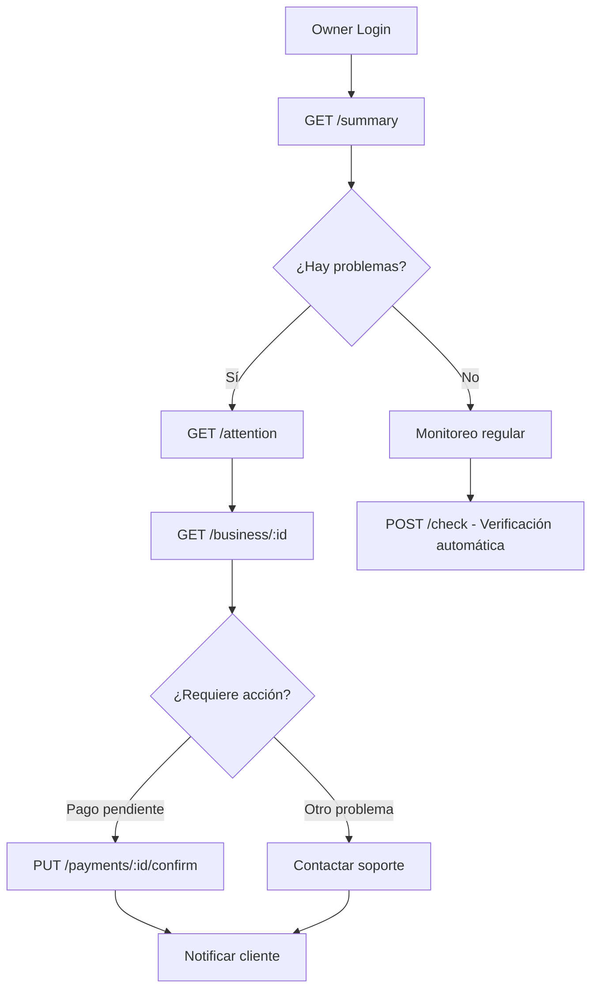

# 📋 API de Gestión de Suscripciones - Owner

Este documento describe todas las rutas disponibles para la gestión y verificación de suscripciones desde el panel de Owner.

## 🔐 Autenticación

**Todas las rutas requieren:**
- Token de autenticación Bearer válido
- Permisos de Owner en el sistema

```bash
Authorization: Bearer <token>
```

## 🌐 Base URL

```
/api/owner/subscription-status
```

---

## 📊 Endpoints Disponibles

### 1. 📈 Resumen General de Suscripciones

**Endpoint:** `GET /summary`

**Descripción:** Obtiene un resumen ejecutivo del estado de todas las suscripciones en la plataforma.

**Ejemplo de Respuesta:**
```json
{
  "success": true,
  "data": {
    "overview": {
      "totalSubscriptions": 250,
      "activeSubscriptions": 195,
      "expiredSubscriptions": 35,
      "suspendedSubscriptions": 20
    },
    "urgentActions": {
      "pendingPayments": 12,
      "expiringSoon": 18,
      "overdue": 8,
      "requiresAttention": 38
    },
    "revenue": {
      "monthlyRecurring": 12450.75,
      "pendingCollection": 980.50,
      "thisMonthCollected": 8750.25
    },
    "trends": {
      "renewalRate": 85.5,
      "churnRate": 14.5,
      "avgSubscriptionValue": 63.85
    }
  }
}
```

### 2. 🔄 Verificación Manual de Suscripciones

**Endpoint:** `POST /check`

**Descripción:** Ejecuta una verificación manual inmediata de suscripciones para actualizar estados y detectar problemas.

**Parámetros del Body:**
```json
{
  "scope": "all", // all, expired, pending, specific
  "businessIds": ["id1", "id2"], // Solo si scope es 'specific'
  "forceUpdate": false
}
```

**Ejemplo de Respuesta:**
```json
{
  "success": true,
  "data": {
    "verificationId": "verify_20241201_143022_abc123",
    "startTime": "2024-12-01T14:30:22.154Z",
    "endTime": "2024-12-01T14:32:18.698Z",
    "processed": {
      "total": 250,
      "updated": 23,
      "errors": 2
    },
    "changes": {
      "statusChanges": 18,
      "newExpirations": 5,
      "reactivations": 3
    },
    "alerts": [
      {
        "type": "warning",
        "businessId": "67508291234567890123456a",
        "businessName": "Salón Bella Vista",
        "message": "Suscripción vencida hace 5 días sin pago confirmado",
        "priority": "high"
      }
    ]
  }
}
```

### 3. 🚨 Suscripciones que Requieren Atención

**Endpoint:** `GET /attention`

**Descripción:** Lista todas las suscripciones que requieren atención inmediata del Owner.

**Parámetros de Query:**
- `priority`: low, medium, high, urgent, all (default: all)
- `type`: expired, payment_pending, payment_failed, expiring_soon, suspended, all (default: all)
- `limit`: Número máximo de resultados (default: 50, max: 100)
- `offset`: Número de resultados a omitir para paginación (default: 0)

**Ejemplo:**
```bash
GET /api/owner/subscription-status/attention?priority=high&type=expired&limit=20
```

### 4. 🔍 Estado Específico de Suscripción

**Endpoint:** `GET /business/:businessId`

**Descripción:** Obtiene información detallada del estado de suscripción de un negocio específico.

**Parámetros de Query:**
- `includeHistory`: boolean (default: false) - Incluir historial de pagos
- `includeModules`: boolean (default: false) - Incluir información de módulos

**Ejemplo:**
```bash
GET /api/owner/subscription-status/business/67508291234567890123456a?includeHistory=true
```

**Ejemplo de Respuesta:**
```json
{
  "success": true,
  "data": {
    "business": {
      "id": "67508291234567890123456a",
      "name": "Salón Bella Vista",
      "email": "contacto@salonbellavista.com",
      "subdomain": "bellavista",
      "registeredAt": "2024-01-15T08:00:00.000Z"
    },
    "subscription": {
      "status": "active",
      "currentPlan": {
        "id": "67508291234567890123456p",
        "name": "Plan Premium",
        "price": 89.99,
        "currency": "COP"
      },
      "startDate": "2024-01-15T08:00:00.000Z",
      "endDate": "2024-12-15T08:00:00.000Z",
      "daysRemaining": 25,
      "autoRenewal": true
    },
    "payment": {
      "lastPayment": {
        "id": "pay_67508291234567890123456a",
        "amount": 89.99,
        "currency": "COP",
        "method": "wompi",
        "status": "completed",
        "date": "2024-11-15T14:30:00.000Z"
      }
    },
    "systemChecks": {
      "lastVerification": "2024-12-01T06:00:00.000Z",
      "accessStatus": "full_access",
      "healthScore": 85
    }
  }
}
```

### 5. ✅ Confirmar Pago Manual

**Endpoint:** `PUT /payments/:paymentId/confirm`

**Descripción:** Permite al Owner confirmar manualmente un pago pendiente y extender automáticamente la suscripción.

**Parámetros del Body:**
```json
{
  "reason": "Pago verificado por transferencia bancaria", // REQUERIDO
  "notes": "Cliente envió comprobante por WhatsApp",
  "amount": 89.99,
  "currency": "COP",
  "paymentMethod": "bank_transfer", // bank_transfer, cash, check, wompi, other
  "transactionReference": "TRF-20241201-001234",
  "extendSubscription": true // default: true
}
```

**Ejemplo de Respuesta:**
```json
{
  "success": true,
  "data": {
    "payment": {
      "id": "pay_67508291234567890123456a",
      "status": "confirmed",
      "previousStatus": "pending",
      "amount": 89.99,
      "currency": "COP",
      "method": "bank_transfer",
      "confirmedAt": "2024-12-01T15:30:00.000Z",
      "confirmedBy": "67508291234567890123456o",
      "confirmationReason": "Pago verificado por transferencia bancaria"
    },
    "subscription": {
      "businessId": "67508291234567890123456a",
      "businessName": "Salón Bella Vista",
      "previousStatus": "expired",
      "newStatus": "active",
      "previousEndDate": "2024-11-15T08:00:00.000Z",
      "newEndDate": "2024-12-15T08:00:00.000Z",
      "daysExtended": 30
    },
    "notifications": {
      "emailSent": true,
      "smsKey": false,
      "inAppNotified": true
    }
  }
}
```

### 6. ❌ Rechazar Pago

**Endpoint:** `PUT /payments/:paymentId/reject`

**Descripción:** Permite al Owner rechazar un pago pendiente con una razón específica.

**Parámetros del Body:**
```json
{
  "reason": "Comprobante inválido", // REQUERIDO
  "notes": "El comprobante no corresponde al monto esperado",
  "notifyBusiness": true // default: true
}
```

### 7. 📜 Historial de Pagos de un Negocio

**Endpoint:** `GET /business/:businessId/history`

**Descripción:** Obtiene el historial completo de pagos de un negocio específico.

**Parámetros de Query:**
- `limit`: Número máximo de resultados (default: 50)
- `offset`: Número de resultados a omitir (default: 0)
- `status`: Filtrar por estado del pago (completed, pending, failed, rejected)
- `dateFrom`: Fecha de inicio (formato: YYYY-MM-DD)
- `dateTo`: Fecha de fin (formato: YYYY-MM-DD)

**Ejemplo:**
```bash
GET /api/owner/subscription-status/business/67508291234567890123456a/history?limit=10&status=completed
```

### 8. 💳 Listar Todos los Pagos de Suscripciones

**Endpoint:** `GET /payments`

**Descripción:** Lista todos los pagos de suscripciones con filtros avanzados y estadísticas.

**Parámetros de Query:**
- `page`: Número de página (default: 1)
- `limit`: Registros por página (default: 20, max: 100)
- `status`: Filtrar por estado (APPROVED, DECLINED, PENDING, ERROR, VOIDED)
- `paymentMethod`: Filtrar por método (WOMPI_CARD, BANK_TRANSFER, PSE, NEQUI)
- `dateFrom`: Fecha de inicio (formato: YYYY-MM-DD)
- `dateTo`: Fecha de fin (formato: YYYY-MM-DD)
- `businessId`: Filtrar por negocio específico
- `sortBy`: Campo para ordenar (default: createdAt)
- `sortOrder`: Orden ASC o DESC (default: DESC)

**Ejemplo:**
```bash
GET /api/owner/subscription-status/payments?page=1&limit=20&status=APPROVED&dateFrom=2024-01-01&dateTo=2024-12-31
```

**Ejemplo de Respuesta:**
```json
{
  "success": true,
  "data": {
    "payments": [
      {
        "id": "pay_67508291234567890123456a",
        "amount": 89.99,
        "currency": "COP",
        "status": "APPROVED",
        "paymentMethod": "WOMPI_CARD",
        "transactionId": "wompi_tx_abc123",
        "createdAt": "2024-11-15T14:30:00.000Z",
        "subscription": {
          "id": "sub_123",
          "status": "active",
          "business": {
            "id": "67508291234567890123456a",
            "name": "Salón Bella Vista",
            "email": "contacto@salonbellavista.com",
            "subdomain": "bellavista"
          },
          "plan": {
            "id": "plan_123",
            "name": "Plan Premium",
            "price": 89.99,
            "currency": "COP"
          }
        }
      }
    ],
    "pagination": {
      "total": 1250,
      "page": 1,
      "limit": 20,
      "totalPages": 63
    },
    "stats": {
      "APPROVED": {
        "count": 1180,
        "totalAmount": 95250.75
      },
      "PENDING": {
        "count": 45,
        "totalAmount": 3640.50
      },
      "DECLINED": {
        "count": 25,
        "totalAmount": 1980.25
      }
    },
    "filters": {
      "status": "APPROVED",
      "dateFrom": "2024-01-01",
      "dateTo": "2024-12-31",
      "page": 1,
      "limit": 20,
      "sortBy": "createdAt",
      "sortOrder": "DESC"
    }
  }
}
```

---

## 🚫 Códigos de Error Comunes

### 401 - No Autorizado
```json
{
  "success": false,
  "error": "Token de acceso requerido"
}
```

### 403 - Prohibido
```json
{
  "success": false,
  "error": "Acceso denegado. Solo usuarios Owner pueden acceder"
}
```

### 404 - No Encontrado
```json
{
  "success": false,
  "error": "Negocio no encontrado"
}
```

### 400 - Solicitud Inválida
```json
{
  "success": false,
  "error": "Parámetros de consulta inválidos"
}
```

### 500 - Error Interno del Servidor
```json
{
  "success": false,
  "message": "Error interno del servidor.",
  "error": "Descripción detallada del error (solo en desarrollo)"
}
```

---

## 📖 Casos de Uso Principales

### 1. Dashboard de Monitoreo
1. Llamar `GET /summary` para obtener métricas generales
2. Llamar `GET /attention` para listar problemas urgentes
3. Mostrar alertas y estadísticas en tiempo real

### 2. Gestión de Pagos Manuales
1. Llamar `GET /payments?status=PENDING` para ver pagos pendientes
2. Revisar comprobantes y validar información
3. Usar `PUT /payments/:id/confirm` o `PUT /payments/:id/reject` según corresponda

### 3. Análisis de Negocio Específico
1. Llamar `GET /business/:id` para estado actual
2. Llamar `GET /business/:id/history` para historial completo
3. Analizar patrones y tomar decisiones de soporte

### 4. Auditoría y Reportes
1. Usar `GET /payments` con filtros de fecha para reportes periódicos
2. Usar `POST /check` para verificaciones programadas
3. Exportar datos para análisis externos

---

## 🔧 Configuración y Middleware

### Middleware Aplicado
```javascript
// Autenticación requerida
router.use(authenticateToken);

// Solo usuarios Owner
router.use(ownerOnly);
```

### Headers Requeridos
```bash
Content-Type: application/json
Authorization: Bearer <token>
```

### Rate Limiting
- 100 requests por minuto por IP
- 500 requests por hora por usuario autenticado

---

## 📝 Notas Importantes

1. **Permisos:** Todas las rutas están restringidas a usuarios con rol de Owner
2. **Logs:** Todas las acciones quedan registradas en auditoría
3. **Notificaciones:** Las confirmaciones/rechazos de pagos envían notificaciones automáticas
4. **Cache:** Los resúmenes se cachean por 5 minutos para mejor rendimiento
5. **Paginación:** Usar `limit` y `offset` para manejar grandes volúmenes de datos

---

## 🔄 Flujo de Verificación Recomendado



Este README proporciona una guía completa para utilizar todas las funcionalidades de gestión de suscripciones desde el panel de Owner.