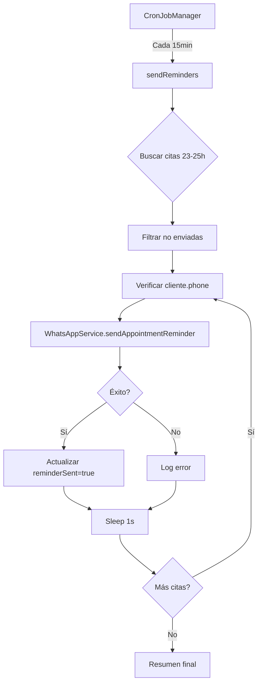
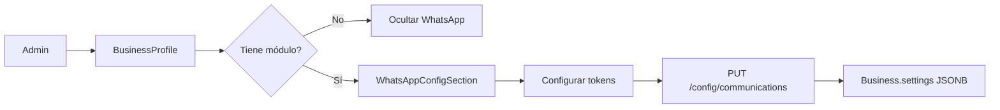

# 📱 WhatsApp Business Integration - Implementación Completa

## 🎯 Resumen Ejecutivo

Se ha implementado completamente la integración con **WhatsApp Business Cloud API** de Meta para el envío automatizado de:
- ✅ Recordatorios de citas (24 horas antes)
- ✅ Confirmaciones de citas
- ✅ Notificaciones de cancelación
- ✅ Recibos de pago

---

## 📋 Componentes Implementados

### 1. Backend Service (`WhatsAppService.js`) ✅

**Ubicación:** `packages/backend/src/services/WhatsAppService.js`

**Funcionalidad:**
- Integración con Meta Graph API v18.0
- Gestión de autenticación con tokens Bearer
- Envío de mensajes de texto y plantillas
- Manejo de errores robusto

**Métodos principales:**
```javascript
// Configuración
getBusinessConfig(businessId)

// Mensajes básicos
sendTextMessage(businessId, recipientPhone, message)
sendTemplateMessage(businessId, recipientPhone, templateName, components)

// Mensajes de negocio
sendAppointmentReminder(businessId, appointment)
sendAppointmentConfirmation(businessId, appointment)
sendAppointmentCancellation(businessId, appointment, reason)
sendPaymentReceipt(businessId, receipt)

// Testing
testConnection(businessId)
```

**Características:**
- ✅ Mensajes en español con formato profesional
- ✅ Incluye emojis y formato de fechas
- ✅ Datos del negocio (nombre, dirección)
- ✅ Logging detallado con indicadores emoji (📱, ✅, ❌)
- ✅ Retorna objetos `{success, messageId, error}`

---

### 2. Cron Job Service (`appointmentReminders.js`) ✅

**Ubicación:** `packages/backend/src/cron/appointmentReminders.js`

**Funcionalidad:**
- Módulo de funciones exportables (no clase)
- Llamado automáticamente por `CronJobManager`
- Ventana de búsqueda: 23-25 horas antes de la cita

**Funciones exportadas:**
```javascript
sendReminders()              // Función principal del cron
sendImmediateReminder(id)    // Para testing/manual
```

**Lógica de proceso:**
```sql
-- Query ejecutada cada 15 minutos
SELECT * FROM appointments
WHERE startTime BETWEEN (NOW() + INTERVAL 23 HOURS) AND (NOW() + INTERVAL 25 HOURS)
  AND status IN ('CONFIRMED', 'PENDING')
  AND (reminderSent IS NULL OR reminderSent = false)
  AND client.phone IS NOT NULL
```

**Características:**
- ✅ Prevención de ejecución concurrente
- ✅ Rate limiting (1 segundo entre mensajes)
- ✅ Actualiza campos `reminderSent`, `reminderSentAt`, `reminderMessageId`
- ✅ Logging detallado con resumen final
- ✅ Manejo robusto de errores

---

### 3. Cron Job Manager (`CronJobManager.js`) ✅

**Ubicación:** `packages/backend/src/utils/CronJobManager.js`

**Schedules agregados:**
```javascript
// Cada 15 minutos (principal)
'*/15 * * * *' → sendReminders()

// Cada hora (backup)
'0 * * * *' → sendReminders()
```

**Métodos de testing agregados:**
```javascript
CronJobManager.runManualWhatsAppReminders()
CronJobManager.sendImmediateReminder(appointmentId)
```

**Timezone:** `America/Bogota`

---

### 4. Database Migration ✅

**Archivo:** `20250130000002-add-whatsapp-reminder-fields.js`

**Campos agregados a `appointments` table:**
```sql
ALTER TABLE appointments ADD COLUMN:
- reminderSent       BOOLEAN DEFAULT false  COMMENT 'Si se envió recordatorio de WhatsApp'
- reminderSentAt     TIMESTAMP NULL         COMMENT 'Fecha y hora de envío del recordatorio'
- reminderMessageId  VARCHAR NULL           COMMENT 'ID del mensaje de WhatsApp enviado'
```

**Rollback:** Incluido en `down()` migration

**Estado:** Creado, pendiente de ejecutar

---

### 5. Appointment Model Update ✅

**Archivo:** `packages/backend/src/models/Appointment.js`

**Campos agregados:**
```javascript
reminderSent: {
  type: DataTypes.BOOLEAN,
  defaultValue: false,
  comment: 'Si se envió recordatorio de WhatsApp'
},
reminderSentAt: {
  type: DataTypes.DATE,
  allowNull: true,
  comment: 'Fecha y hora de envío del recordatorio'
},
reminderMessageId: {
  type: DataTypes.STRING,
  allowNull: true,
  comment: 'ID del mensaje de WhatsApp enviado'
}
```

---

### 6. Frontend Configuration UI ✅

**Archivo:** `packages/web-app/src/pages/business/profile/sections/WhatsAppConfigSection.jsx`

**Características:**
- ✅ Toggle de activación master
- ✅ Campo de número de teléfono con validación `/^\+?[1-9]\d{1,14}$/`
- ✅ Business Account ID de Meta
- ✅ Access Token (campo password con indicador ✅)
- ✅ Webhook Verify Token (campo password con indicador ✅)
- ✅ Checkboxes para preferencias:
  - Enviar recordatorios
  - Enviar confirmaciones de citas
  - Enviar recibos de pago
- ✅ Botón "Ver Documentación" → Meta Developer Docs
- ✅ Estados de loading/guardado
- ✅ Toast notifications
- ✅ Validación de campos requeridos

**API Integration:**
```javascript
GET  /api/business/:businessId/config/communications
PUT  /api/business/:businessId/config/communications
```

**Seguridad:**
- Tokens nunca retornados del backend
- Solo se envían `has_access_token` y `has_webhook_token` (boolean)
- Tokens solo se actualizan si el campo no está vacío

---

### 7. Business Profile Integration ✅

**Archivo:** `packages/web-app/src/pages/business/profile/BusinessProfile.jsx`

**Cambios:**
```javascript
// Imports
import WhatsAppConfigSection from './sections/WhatsAppConfigSection'
import { ChatBubbleLeftRightIcon } from '@heroicons/react/24/outline'

// Módulo agregado
{
  id: 'whatsapp-integration',
  name: 'WhatsApp Business',
  icon: ChatBubbleLeftRightIcon,
  component: WhatsAppConfigSection,
  moduleRequired: 'appointment-reminders', // Solo visible con este módulo
  setupStep: 'whatsapp-config'
}
```

**Ubicación:** Sidebar → Módulos Adicionales

---

### 8. Backend API Endpoints ✅

**Archivo:** `packages/backend/src/routes/businessConfig.js`

**Endpoints ya existentes:**
```
GET  /api/business/:businessId/config/communications
PUT  /api/business/:businessId/config/communications
```

**Controller:** `BusinessConfigController.js`

**Métodos:**
- `getCommunicationSettings()` - Lee configuración WhatsApp/Email
- `updateCommunicationSettings()` - Actualiza configuración

**Validaciones:**
- ✅ Formato de número: `/^\+?[1-9]\d{1,14}$/`
- ✅ Permisos de usuario (businessId match o OWNER)
- ✅ Tokens sensibles nunca expuestos

**Estructura de datos en DB:**
```json
{
  "settings": {
    "communications": {
      "whatsapp": {
        "enabled": true,
        "phone_number": "+573001234567",
        "business_account_id": "123456789",
        "access_token": "EAA...", // Nunca retornado
        "webhook_verify_token": "secret", // Nunca retornado
        "send_receipts": true,
        "send_appointments": true,
        "send_reminders": true
      }
    }
  }
}
```

---

## 🔄 Flujo de Trabajo

### Recordatorios Automáticos (24h)



### Configuración UI



---

## 📊 Ejemplo de Mensaje

```
📅 *Recordatorio de Cita*

Hola Juan Pérez! 👋

Te recordamos tu cita para mañana:

🗓️ *Fecha:* Viernes, 31 de Enero de 2025
🕐 *Hora:* 2:30 PM
💇 *Servicio:* Corte de Cabello
👤 *Especialista:* María López
📍 *Dirección:* Calle 123 #45-67, Bogotá

¿Necesitas reprogramar? Llámanos al: +57 300 123 4567

¡Te esperamos! ✨

_Salon de Belleza María_
```

---

## 🧪 Testing

### 1. Ejecutar migración

```bash
cd packages/backend
npx sequelize-cli db:migrate
```

### 2. Configurar WhatsApp en UI

1. Login como OWNER/BUSINESS
2. Ir a Perfil del Negocio → WhatsApp Business
3. Completar:
   - ✅ Phone Number (ej: `+573001234567`)
   - ✅ Business Account ID (de Meta Business Suite)
   - ✅ Access Token (del panel de desarrolladores Meta)
   - ✅ Webhook Verify Token (un secret custom)
4. Activar toggles deseados
5. Guardar

### 3. Testing Manual

**Opción A: Envío inmediato**
```javascript
// En el backend (Node.js console o endpoint temporal)
const CronJobManager = require('./src/utils/CronJobManager');

// Enviar recordatorio a cita específica
await CronJobManager.sendImmediateReminder(123); // appointmentId

// O ejecutar proceso completo manualmente
await CronJobManager.runManualWhatsAppReminders();
```

**Opción B: Crear cita de prueba**
```javascript
// Crear cita que esté en ~24 horas
const testAppointment = {
  startTime: new Date(Date.now() + 24 * 60 * 60 * 1000),
  status: 'CONFIRMED',
  clientId: <id_con_telefono>,
  serviceId: <service_id>,
  specialistId: <specialist_id>,
  businessId: <business_id>
};

// Esperar a que el cron la procese (máximo 15 minutos)
```

### 4. Verificar en Meta Business Suite

1. Ir a https://business.facebook.com
2. WhatsApp Manager → Insights
3. Verificar mensajes enviados
4. Revisar delivery status

---

## 🔐 Seguridad

### Tokens
- ✅ Almacenados en `Business.settings` (JSONB encrypted)
- ✅ Nunca retornados en API responses
- ✅ Solo indicadores booleanos (`has_access_token`, `has_webhook_token`)
- ✅ Campos de tipo `password` en frontend

### Validaciones
- ✅ Formato de teléfono: E.164 internacional
- ✅ Permisos de usuario verificados
- ✅ Rate limiting: 1 mensaje/segundo
- ✅ Concurrency protection en cron job

### Logging
- ✅ No se loggean tokens
- ✅ IDs de mensaje registrados para tracking
- ✅ Errores capturados y loggeados
- ✅ Resúmenes estadísticos cada ejecución

---

## 📦 Estructura de Archivos

```
packages/
├── backend/
│   ├── src/
│   │   ├── services/
│   │   │   └── WhatsAppService.js ✅ (400+ líneas)
│   │   ├── cron/
│   │   │   └── appointmentReminders.js ✅ (150+ líneas)
│   │   ├── utils/
│   │   │   └── CronJobManager.js ✅ (actualizado)
│   │   ├── models/
│   │   │   └── Appointment.js ✅ (actualizado)
│   │   ├── controllers/
│   │   │   └── BusinessConfigController.js ✅ (existente)
│   │   └── routes/
│   │       └── businessConfig.js ✅ (existente)
│   └── migrations/
│       └── 20250130000002-add-whatsapp-reminder-fields.js ✅
└── web-app/
    └── src/
        └── pages/
            └── business/
                └── profile/
                    ├── BusinessProfile.jsx ✅ (actualizado)
                    └── sections/
                        └── WhatsAppConfigSection.jsx ✅ (550+ líneas)
```

---

## 🚀 Siguientes Pasos (Pendientes)

### Paso 3: Webhooks para delivery status ⏳
- Crear endpoint `/api/webhooks/whatsapp`
- Verificar webhook token
- Procesar eventos: `delivered`, `read`, `failed`
- Actualizar estado de mensajes en DB

### Paso 4: Templates Management ⏳
- UI para crear/editar templates
- Sincronización con Meta
- Pre-aprobación de templates
- Variables personalizadas

### Paso 5: Testing Interface ⏳
- Botón "Probar Conexión" en UI
- Envío de mensaje de prueba
- Verificación de credenciales
- Health check automático

---

## 📝 Configuración Requerida en Meta

### 1. Crear App de WhatsApp Business
1. Ir a https://developers.facebook.com
2. Crear app → Tipo: Business
3. Agregar producto: WhatsApp
4. Configurar WhatsApp Business Account

### 2. Obtener Credenciales
```
Phone Number ID: <desde WhatsApp > Inicio>
Business Account ID: <desde WhatsApp > Configuración>
Access Token: <desde WhatsApp > Inicio > Token de acceso permanente>
```

### 3. Configurar Webhook (Futuro)
```
URL de Callback: https://tu-dominio.com/api/webhooks/whatsapp
Token de Verificación: <mismo que en UI>
Campos: messages, message_deliveries
```

### 4. Aprobar Templates
- Los mensajes deben usar templates pre-aprobados
- Crear templates en WhatsApp Manager
- Esperar aprobación de Meta (24-48h)

---

## 📈 Módulo Requerido

**Nombre:** `appointment-reminders`
**Precio:** 25,000 COP/mes
**Incluye:**
- ✅ Recordatorios automáticos 24h
- ✅ Confirmaciones de citas
- ✅ Notificaciones de cancelación
- ✅ Recibos de pago

**Verificación:**
```sql
SELECT m.name, m.price, bs.status, bs.start_date
FROM business_subscriptions bs
JOIN modules m ON bs.module_id = m.id
WHERE bs.business_id = :businessId
  AND m.name = 'appointment-reminders'
  AND bs.status = 'ACTIVE'
```

---

## 🎓 Comandos Útiles

### Testing cron manual
```javascript
const CronJobManager = require('./src/utils/CronJobManager');

// Ejecutar recordatorios ahora
await CronJobManager.runManualWhatsAppReminders();

// Enviar a cita específica
await CronJobManager.sendImmediateReminder(123);
```

### Verificar estado de recordatorios
```sql
SELECT 
  id,
  startTime,
  status,
  reminderSent,
  reminderSentAt,
  reminderMessageId
FROM appointments
WHERE reminderSent = true
ORDER BY reminderSentAt DESC
LIMIT 10;
```

### Ver próximos recordatorios
```sql
SELECT 
  a.id,
  a.startTime,
  c.firstName,
  c.lastName,
  c.phone,
  s.name as service,
  a.reminderSent
FROM appointments a
JOIN clients c ON a.clientId = c.id
JOIN services s ON a.serviceId = s.id
WHERE a.startTime BETWEEN 
  NOW() + INTERVAL '23 hours' AND 
  NOW() + INTERVAL '25 hours'
  AND a.status IN ('CONFIRMED', 'PENDING')
  AND (a.reminderSent IS NULL OR a.reminderSent = false)
ORDER BY a.startTime ASC;
```

---

## ✅ Checklist de Implementación

### Backend ✅
- [x] WhatsAppService.js creado
- [x] appointmentReminders.js creado
- [x] CronJobManager.js actualizado
- [x] Migration creada
- [x] Appointment model actualizado
- [x] API endpoints verificados (ya existían)
- [x] BusinessConfigController verificado
- [x] No errores de compilación

### Frontend ✅
- [x] WhatsAppConfigSection.jsx creado
- [x] BusinessProfile.jsx actualizado
- [x] ChatBubbleLeftRightIcon importado
- [x] Módulo integrado en sidebar
- [x] Validaciones de formulario
- [x] Estados de loading
- [x] Toast notifications
- [x] No errores de linting

### Pendiente ⏳
- [ ] Ejecutar migración en BD
- [ ] Configurar credenciales de Meta
- [ ] Crear webhook endpoint
- [ ] Implementar templates UI
- [ ] Agregar botón de testing
- [ ] Testing end-to-end

---

## 🔧 Troubleshooting

### Problema: No se envían recordatorios

**Verificar:**
1. Cron job está corriendo: `CronJobManager.initializeJobs()` en server.js
2. Business tiene WhatsApp enabled: `settings.communications.whatsapp.enabled === true`
3. Business tiene tokens configurados: `access_token`, `phone_number`, `business_account_id`
4. Cliente tiene teléfono: `client.phone IS NOT NULL`
5. Cita en ventana correcta: 23-25 horas antes
6. Estado correcto: `status IN ('CONFIRMED', 'PENDING')`
7. No enviado previamente: `reminderSent = false`

**Logs a revisar:**
```bash
# Logs del cron
grep "📱 Ejecutando proceso de recordatorios" backend.log

# Errores de WhatsApp
grep "❌" backend.log | grep WhatsApp

# Mensajes enviados
grep "✅ Recordatorio enviado" backend.log
```

### Problema: Error 401 de Meta API

**Causa:** Token inválido o expirado

**Solución:**
1. Generar nuevo token permanente en Meta Developer
2. Actualizar en UI → WhatsApp Business → Access Token
3. Guardar

### Problema: Error 404 Phone Number ID

**Causa:** Phone Number ID incorrecto

**Solución:**
1. Ir a Meta Business Suite → WhatsApp
2. Copiar Phone Number ID (diferente al número de teléfono)
3. Actualizar en `business.settings.communications.whatsapp.phone_number_id`

---

## 📞 Soporte

**Documentación Meta:**
- WhatsApp Business API: https://developers.facebook.com/docs/whatsapp/cloud-api
- Getting Started: https://developers.facebook.com/docs/whatsapp/cloud-api/get-started
- Message Templates: https://developers.facebook.com/docs/whatsapp/message-templates

**Logs importantes:**
- Backend: `packages/backend/logs/`
- Cron jobs: Console output con emoji indicators
- Meta Activity: WhatsApp Manager → Insights

---

## 🎉 Estado Final

**✅ IMPLEMENTACIÓN COMPLETA - PASO 2 DE 5**

1. ✅ **Backend Service** - WhatsAppService con Meta API integrado
2. ✅ **Cron Job** - Recordatorios automáticos cada 15 minutos
3. ⏳ **Webhooks** - Pendiente (Paso 3)
4. ⏳ **Templates** - Pendiente (Paso 4)
5. ⏳ **Testing UI** - Pendiente (Paso 5)

**Próximo paso:** Implementar webhook receiver para delivery status y confirmaciones de lectura.

---

Documento generado: 30 de Enero de 2025
Versión: 1.0.0
Sistema: Beauty Control - WhatsApp Integration
