# 💳 Sistema de Pagos 3D Secure y Recurrentes con Wompi

Este documento describe la implementación completa del sistema de pagos con **3D Secure (3DS)** para la creación segura de fuentes de pago y **3RI (3D Secure Requestor Initiated)** para pagos recurrentes automáticos.

## 🎯 **Resumen del Sistema**

### **Problema Resuelto:**
- ✅ Pagos recurrentes automáticos para suscripciones
- ✅ Tokenización segura de tarjetas con 3D Secure
- ✅ Transición automática de TRIAL → ACTIVE
- ✅ Gestión completa del ciclo de vida de suscripciones

### **Flujo Principal:**
1. **TRIAL**: Usuario registra método de pago con 3DS (sin cobro)
2. **Autenticación**: Completa el flujo 3DS con el banco
3. **Token Seguro**: Se guarda token para futuros cobros
4. **Auto-renovación**: Cobros automáticos con 3RI

---

## 🏗️ **Arquitectura del Sistema**

### **Componentes Principales:**

#### **1. Modelo de Base de Datos**
```sql
-- Nuevos campos en subscription_payments
payment_source_token VARCHAR(255),      -- Token 3DS para pagos recurrentes
is_three_ds_enabled BOOLEAN,            -- Si usa 3D Secure
three_ds_auth_data JSONB,               -- Datos completos de autenticación
is_recurring_payment BOOLEAN,           -- Si es pago recurrente
original_payment_id UUID,               -- Referencia al pago inicial
recurring_type ENUM,                    -- INITIAL, RECURRING, MANUAL
auto_renewal_enabled BOOLEAN            -- Si auto-renovación está activa
```

#### **2. Servicio Principal**
**`Wompi3DSService`** - Maneja toda la lógica de 3DS/3RI
- Crear fuentes de pago seguras
- Consultar estados del flujo 3DS
- Procesar transacciones recurrentes
- Verificar y actualizar estados

#### **3. Controlador de API**
**`Payment3DSController`** - Endpoints para el frontend
- Registrar métodos de pago
- Consultar estado 3DS
- Completar autenticación
- Procesar renovaciones

---

## 📡 **API Endpoints**

### **Base URL**: `/api/payments/3ds`

#### **1. Registrar Método de Pago (TRIAL)**
```http
POST /api/payments/3ds/register
Authorization: Bearer <token>
Content-Type: application/json

{
  "token": "tok_devint_1854_b9D8b065dF326f393aD27cc86fA373c8",
  "customerEmail": "usuario@negocio.com",
  "acceptanceToken": "eyJhbGciOiJIUzI1NiJ9...",
  "businessSubscriptionId": "uuid-optional"
}
```

**Respuesta:**
```json
{
  "success": true,
  "data": {
    "subscriptionPaymentId": "uuid",
    "paymentSourceId": 71942,
    "requires3DSAuth": true,
    "status": "PENDING",
    "threeDSData": {
      "currentStep": "BROWSER_INFO",
      "stepStatus": "PENDING",
      "htmlContent": "<!-- HTML para renderizar -->"
    }
  }
}
```

#### **2. Consultar Estado 3DS**
```http
GET /api/payments/3ds/status/:paymentSourceId
Authorization: Bearer <token>
```

**Respuesta:**
```json
{
  "success": true,
  "data": {
    "paymentSourceId": 71942,
    "status": "AVAILABLE",
    "isComplete": true,
    "currentStep": "AUTHENTICATION",
    "stepStatus": "COMPLETED",
    "htmlContent": null,
    "cardInfo": {
      "bin": "230377",
      "last_four": "0275",
      "exp_month": "10",
      "exp_year": "31",
      "card_holder": "NOMBRE TITULAR"
    }
  }
}
```

#### **3. Completar Proceso 3DS**
```http
POST /api/payments/3ds/complete/:paymentSourceId
Authorization: Bearer <token>
```

#### **4. Procesar Renovación (TRIAL → ACTIVE)**
```http
POST /api/payments/3ds/process-renewal
Authorization: Bearer <token>
Content-Type: application/json

{
  "amount": 89.99,
  "planId": "uuid-optional"
}
```

#### **5. Listar Métodos de Pago**
```http
GET /api/payments/3ds/methods
Authorization: Bearer <token>
```

#### **6. Deshabilitar Auto-renovación**
```http
POST /api/payments/3ds/disable-auto-renewal/:paymentId
Authorization: Bearer <token>
```

---

## 🔄 **Flujos de Trabajo**

### **A. Registro Durante TRIAL**

```mermaid
graph TD
    A[Usuario en TRIAL] --> B[Frontend: Capturar Tarjeta]
    B --> C[POST /3ds/register]
    C --> D[Wompi: Crear Payment Source]
    D --> E{¿Requiere 3DS?}
    E -->|Sí| F[Renderizar HTML Browser Info]
    E -->|No| M[Token Listo]
    F --> G[Consultar Estado: GET /3ds/status]
    G --> H{¿Paso Completado?}
    H -->|No| I[Continuar con siguiente paso]
    H -->|Sí| J[¿Es último paso?]
    J -->|No| I
    J -->|Sí| K[POST /3ds/complete]
    I --> G
    K --> M[Token Guardado - Auto-renovación Activa]
    M --> N[Usuario puede usar todas las funciones]
```



### **B. Renovación Automática**


---

## 🖥️ **Implementación Frontend**

### **1. Registrar Método de Pago**

```javascript
// Fase 1: Tokenizar tarjeta con Wompi
const tokenizeCard = async (cardData) => {
  const response = await fetch('https://production.wompi.co/v1/tokens/cards', {
    method: 'POST',
    headers: {
      'Authorization': `Bearer ${WOMPI_PUBLIC_KEY}`,
      'Content-Type': 'application/json'
    },
    body: JSON.stringify({
      number: cardData.number,
      cvc: cardData.cvc,
      exp_month: cardData.expMonth,
      exp_year: cardData.expYear,
      card_holder: cardData.cardHolder
    })
  });
  return response.json();
};

// Fase 2: Registrar con 3DS
const register3DSPayment = async (token) => {
  const response = await fetch('/api/payments/3ds/register', {
    method: 'POST',
    headers: {
      'Authorization': `Bearer ${userToken}`,
      'Content-Type': 'application/json'
    },
    body: JSON.stringify({
      token: token.data.id,
      customerEmail: user.email,
      acceptanceToken: acceptanceToken
    })
  });
  return response.json();
};

// Fase 3: Manejar flujo 3DS
const handle3DSFlow = async (paymentSourceId) => {
  const pollStatus = async () => {
    const response = await fetch(`/api/payments/3ds/status/${paymentSourceId}`, {
      headers: { 'Authorization': `Bearer ${userToken}` }
    });
    const data = await response.json();
    
    if (data.data.htmlContent) {
      // Renderizar HTML del banco
      document.getElementById('3ds-container').innerHTML = data.data.htmlContent;
    }
    
    if (data.data.isComplete) {
      // Completar proceso
      await fetch(`/api/payments/3ds/complete/${paymentSourceId}`, {
        method: 'POST',
        headers: { 'Authorization': `Bearer ${userToken}` }
      });
      return true;
    }
    
    // Continuar consultando cada 2 segundos
    setTimeout(pollStatus, 2000);
  };
  
  pollStatus();
};
```

### **2. Procesar Renovación**

```javascript
const processRenewal = async (amount) => {
  const response = await fetch('/api/payments/3ds/process-renewal', {
    method: 'POST',
    headers: {
      'Authorization': `Bearer ${userToken}`,
      'Content-Type': 'application/json'
    },
    body: JSON.stringify({ amount })
  });
  
  const result = await response.json();
  
  if (result.success) {
    // Suscripción activada exitosamente
    window.location.href = '/dashboard?activated=true';
  } else {
    // Mostrar error de pago
    showError('El pago no pudo ser procesado');
  }
};
```

---

## ⚙️ **Configuración del Sistema**

### **Variables de Entorno**

```bash
# Wompi Configuration
WOMPI_BASE_URL=https://production.wompi.co/v1
WOMPI_PUBLIC_KEY=pub_prod_xxxxx
WOMPI_PRIVATE_KEY=prv_prod_xxxxx

# Habilitar 3DS (debe solicitarse a Wompi)
WOMPI_3DS_ENABLED=true
```

### **Migración de Base de Datos**

```bash
# Ejecutar migración para nuevos campos
psql -d beauty_control -f migrations/add-3ds-fields.sql
```

---

## 🚨 **Estados y Errores**

### **Estados de Payment Source (3DS)**
- `PENDING` - Esperando autenticación 3DS
- `AVAILABLE` - Token listo para usar
- `DECLINED` - Autenticación fallida
- `ERROR` - Error en el proceso

### **Estados de Transacción (3RI)**
- `APPROVED` - Pago exitoso
- `DECLINED` - Pago rechazado
- `PENDING` - En proceso
- `ERROR` - Error en transacción

### **Manejo de Errores Comunes**

```javascript
const errorHandling = {
  'CARD_DECLINED': 'Tarjeta rechazada por el banco',
  'INSUFFICIENT_FUNDS': 'Fondos insuficientes',
  'EXPIRED_CARD': 'Tarjeta vencida',
  'INVALID_CARD': 'Datos de tarjeta inválidos',
  '3DS_FAILED': 'Autenticación 3D Secure falló',
  'TOKEN_EXPIRED': 'Token de pago expirado'
};
```

---

## 📊 **Monitoreo y Métricas**

### **Métricas Clave**
- Tasa de éxito de autenticación 3DS
- Tasa de conversión TRIAL → ACTIVE
- Tasa de fallo en pagos recurrentes
- Tiempo promedio de completar 3DS

### **Logs Importantes**
```bash
# Crear fuente de pago
🔐 Creando fuente de pago segura con 3DS: usuario@negocio.com

# Estado 3DS
📊 Estado de fuente de pago: {id: 71942, status: "AVAILABLE", currentStep: "AUTHENTICATION"}

# Pago recurrente
🔄 Creando transacción recurrente con 3RI: renewal_businessId_timestamp
```

---

## 🔒 **Consideraciones de Seguridad**

### **1. Tokenización Segura**
- Tokens 3DS válidos solo para el comercio
- Datos de tarjeta nunca almacenados
- Comunicación encriptada con Wompi

### **2. Validaciones**
- Verificar ownership del payment source
- Validar estados antes de procesar
- Timeout en consultas 3DS

### **3. Compliance**
- PCI DSS compliant (Wompi certificado)
- 3D Secure 2.2 protocol
- Cumplimiento SCA europea

---

## 🎯 **Próximos Pasos**

1. **Testing**: Probar en sandbox de Wompi
2. **Frontend**: Implementar componentes 3DS
3. **Monitoreo**: Configurar alertas de fallos
4. **Documentación**: Guías de usuario final

---

## 📞 **Soporte y Troubleshooting**

### **Problemas Comunes:**

**Q: El 3DS no inicia**
A: Verificar que Wompi tenga 3DS habilitado para tu comercio

**Q: Los pagos recurrentes fallan**
A: Verificar que el token no haya expirado (validity_ends_at)

**Q: El usuario abandona el flujo 3DS**
A: Implementar reintentos y notificaciones

### **Contacto Wompi:**
- Gestión de fraude para habilitar 3DS
- Soporte técnico para configuraciones

Este sistema proporciona una solución completa y segura para pagos recurrentes, cumpliendo con los estándares internacionales de seguridad y ofreciendo una experiencia de usuario optimizada.