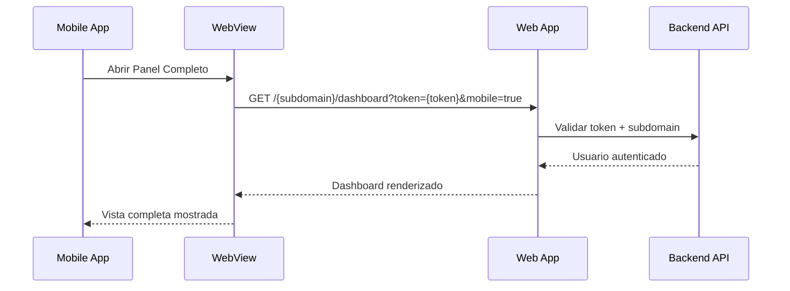

# Documentación: Integración Web App con Mobile App
## Beauty Control - Requerimientos para Soporte Mobile

### 📋 Resumen General
La aplicación móvil utilizará **WebView** para mostrar funcionalidades completas de la web app, mientras mantiene métricas y funciones básicas en nativo. Se requiere implementar rutas específicas y autenticación automática para una experiencia fluida.

---

## 🌐 Rutas Requeridas

### 1. Dashboard Business/Propietario
**Ruta:** `/{subdomain}/dashboard?token={token}&mobile=true`

**Parámetros:**
- `subdomain`: Subdominio del salón (ej: "mi-salon")
- `token`: Token JWT del usuario autenticado
- `mobile`: Siempre `true` cuando viene desde la app móvil

**Funcionalidad:**
- Autenticación automática usando el token
- Vista completa del dashboard de propietario
- Gestión avanzada, reportes, configuraciones
- Adaptación opcional de UI para móvil

---

### 2. Dashboard Recepcionista (Futuro)
**Ruta:** `/{subdomain}/reception?token={token}&mobile=true`

**Funcionalidad:**
- Gestión completa de todas las agendas
- Configuración de turnos avanzada
- Gestión de clientes y productos
- Reportes de recepción

---

### 3. Panel de Turnos (Futuro)
**Ruta:** `/{subdomain}/appointments?token={token}&mobile=true`

**Funcionalidad:**
- Vista completa de calendario
- Gestión de turnos por especialista
- Configuraciones de servicios
- Historial completo

---

## 🔐 Autenticación Automática

### Implementación Requerida
```javascript
// En el componente que recibe la ruta
useEffect(() => {
  const urlParams = new URLSearchParams(window.location.search);
  const token = urlParams.get('token');
  const isMobile = urlParams.get('mobile') === 'true';
  
  if (token) {
    // Autenticar automáticamente
    dispatch(authenticateWithToken(token));
    // O usar tu método de autenticación actual
    localStorage.setItem('authToken', token);
    // Redireccionar o actualizar estado de auth
  }
  
  if (isMobile) {
    // Opcional: Adaptar interfaz para móvil
    document.body.classList.add('mobile-view');
  }
}, []);
```

### Validaciones Necesarias
- ✅ Verificar que el token sea válido
- ✅ Verificar que el usuario tenga permisos para el subdomain
- ✅ Manejar tokens expirados
- ✅ Redirección a login si falla la autenticación

---

## 📱 Consideraciones de UX Móvil

### Adaptaciones Recomendadas (Opcional)
```css
/* Cuando mobile=true */
.mobile-view {
  /* Ajustar espaciado para táctil */
  --touch-target-min: 44px;
  
  /* Simplificar navegación */
  .sidebar { display: none; }
  
  /* Aumentar botones */
  button { min-height: 44px; }
  
  /* Scroll más fluido */
  overflow-y: scroll;
  -webkit-overflow-scrolling: touch;
}
```

### Elementos UI a Considerar
- **Botones más grandes** para interacción táctil
- **Navegación simplificada** (ocultar sidebar si existe)
- **Scroll optimizado** para móvil
- **Carga progresiva** para mejor performance

---

## 🔧 Variables de Entorno

### Configuración Actual (.env)
```bash
FRONTEND_URL=http://localhost:3000
```

### URLs que Recibirá
**Desarrollo:**
- `http://localhost:3000/{subdomain}/dashboard?token={token}&mobile=true`

**Producción (Futuro):**
- `https://{subdomain}.beautycontrol.com/dashboard?token={token}&mobile=true`

---

## 🚀 Orden de Implementación Sugerido

### Fase 1 - Dashboard Business ⚡ (Prioridad Alta)
1. Crear ruta `/{subdomain}/dashboard`
2. Implementar autenticación por token en URL
3. Validar acceso por subdomain
4. Testing básico de integración

### Fase 2 - Optimización UX 📱 (Prioridad Media)
1. Detectar parámetro `mobile=true`
2. Aplicar estilos móviles opcionales
3. Optimizar performance para WebView
4. Testing en dispositivos

### Fase 3 - Dashboards Adicionales 📋 (Prioridad Baja)
1. Ruta para recepcionista
2. Panel de turnos especializado
3. Configuraciones adicionales

---

## 🧪 Testing Requerido

### Casos de Prueba
```javascript
// Ejemplo de URLs para testing
const testUrls = [
  'http://localhost:3000/demo-salon/dashboard?token=jwt-token-here&mobile=true',
  'http://localhost:3000/mi-salon/dashboard?token=invalid-token&mobile=true',
  'http://localhost:3000/no-existe/dashboard?token=jwt-token-here&mobile=true'
];
```

### Escenarios a Validar
- ✅ **Token válido + subdomain válido** → Acceso exitoso
- ❌ **Token inválido** → Redirección a login
- ❌ **Subdomain no existe** → Error 404 o mensaje apropiado
- ⏱️ **Token expirado** → Refresh automático o re-login
- 📱 **Parámetro mobile** → Adaptación UI (si implementado)

---

## 📋 Checklist de Implementación

### Backend/API
- [ ] Endpoint para validar token + subdomain
- [ ] Manejo de CORS para WebView
- [ ] Rate limiting apropiado
- [ ] Logs de acceso mobile

### Frontend
- [ ] Ruta `/{subdomain}/dashboard`
- [ ] Autenticación automática por token
- [ ] Validación de subdomain
- [ ] Parámetro mobile detection
- [ ] Estilos mobile (opcional)
- [ ] Manejo de errores
- [ ] Testing en Chrome DevTools (Mobile simulation)

### Testing
- [ ] Token válido funciona
- [ ] Token inválido redirige apropiadamente
- [ ] Subdomain inexistente maneja error
- [ ] UI se adapta con mobile=true
- [ ] Performance acceptable en WebView
- [ ] No hay errores de consola

---

## 🔄 Flujo de Integración



---

## 📞 Puntos de Contacto

### Para Dudas Técnicas
- **Token format**: JWT estándar con expiración
- **Subdomain validation**: Verificar en base de datos
- **Mobile parameter**: Boolean para adaptación UI

### Próximos Pasos
1. **Implementar Fase 1** (Dashboard Business)
2. **Testing inicial** con URL de prueba
3. **Integración con mobile** para validación
4. **Iteración y mejoras** según feedback

---

*Documentación generada el ${new Date().toISOString().split('T')[0]} para Beauty Control Mobile Integration*